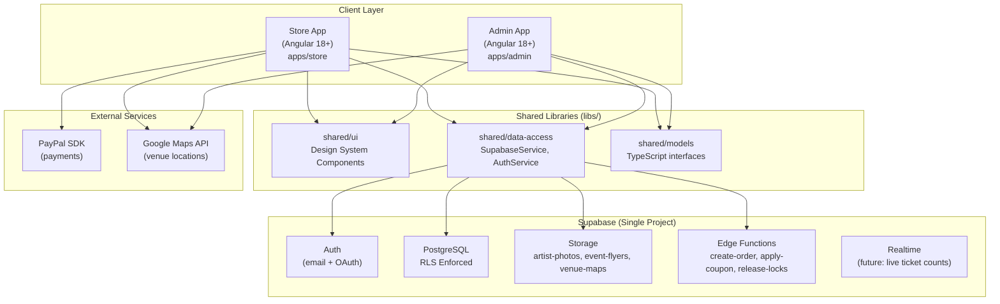
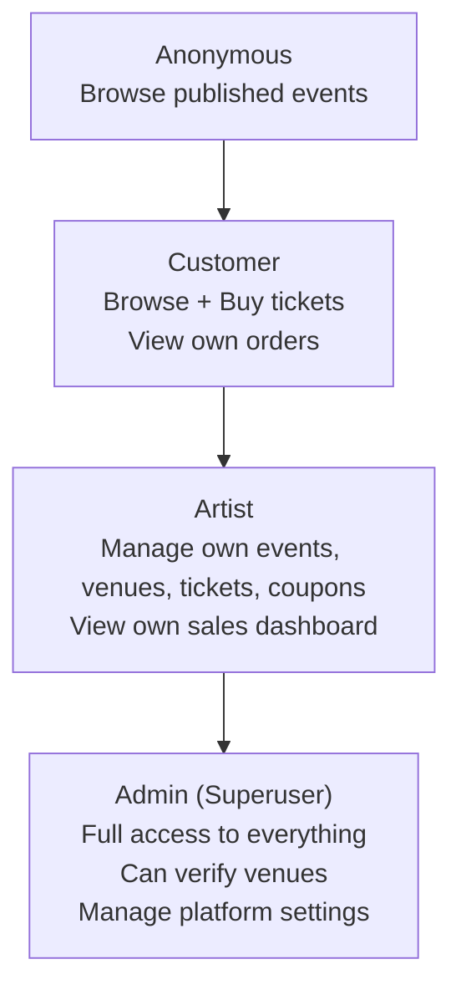

# TicketFlow — Project Overview & Architecture

> A ticket-selling platform with two Angular apps sharing a single Supabase project.

---

## Vision

**TicketFlow** connects artists with their audiences through a streamlined, role-based ticket platform. It consists of two separate Angular applications that share the same Supabase backend:

| App | Audience | Purpose |
|-----|----------|---------|
| **Admin App** (`apps/admin`) | Artists & Admins | Create and manage events, venues, ticket types, coupons |
| **Store App** (`apps/store`) | End customers | Discover events, buy tickets, manage purchases |

---

## Design System — Color Palette

| Token | Hex | Usage |
|-------|-----|-------|
| `primary` | `#0bdef5` | Main color — links, active states, brand elements |
| `surface` | `#fff3f0` | Text & icons on **dark** backgrounds |
| `accent` | `#f7e733` | Playful highlight — stats, prices, featured badges |
| `dark` | `#150811` | Text & icons on **light** backgrounds |
| `contrast` | `#e11392` | CTAs, urgency, danger actions |

### Usage Guidelines
- Dark sidebars/hero sections use `dark` background + `surface` text + `primary` highlights
- Key numbers and prices always use `accent` to draw the eye
- Primary action buttons (buy, save, publish) use `primary` or `contrast`
- Destructive or urgent actions always use `contrast`

---

## Architecture Principles

### 1. Vertical Slicing
Every feature is a **self-contained vertical slice**:

```
feature-events/
├── event-list/          ← Component
├── event-form/          ← Component
├── event-detail/        ← Component
├── events.service.ts    ← Data access
├── event.model.ts       ← TypeScript interfaces
└── events.routes.ts     ← Lazy routes
```

No shared horizontal layers that span features (no global "components/" dumping ground). Cross-feature UI goes in `shared/ui/`.

### 2. Standalone Components (No NgModules)
Every component, pipe, and directive uses `standalone: true`. Routing uses `loadComponent` and `loadChildren` for lazy loading. Zero NgModules in this project.

### 3. Single Supabase Project
Both apps connect to the same Supabase project using the same `ANON_KEY`. Row Level Security (RLS) enforces data isolation — artists see only their own data, customers see only their own orders, and published events are visible to everyone.

### 4. Monorepo (Nx Workspace)
Apps and shared libraries live in one Nx monorepo. Build tooling (TypeScript paths, Tailwind config, type generation) is shared at the root level.

---

## System Architecture



---

## Role Hierarchy



| Role | Registration | Source |
|------|-------------|--------|
| `anonymous` | Auto (unauthenticated) | — |
| `customer` | Register on Store App | `user_roles` |
| `artist` | Register on Admin App | `user_roles` |
| `admin` | Manual assignment | `user_roles` |

---

## Monorepo Structure

```
tickets/
├── apps/
│   ├── admin/                      # Artist management portal
│   │   └── src/
│   │       ├── app/
│   │       └── features/
│   │           ├── auth/
│   │           ├── dashboard/
│   │           ├── artists/
│   │           ├── events/
│   │           ├── venues/
│   │           └── tickets/
│   └── store/                      # Public ticket store
│       └── src/
│           ├── app/
│           └── features/
│               ├── auth/
│               ├── home/
│               ├── search/
│               ├── event-detail/
│               ├── checkout/
│               └── my-tickets/
├── libs/
│   └── shared/
│       ├── ui/                     # Button, Card, Badge, StatCard, etc.
│       ├── data-access/            # SupabaseService, AuthService
│       └── models/                 # Shared TypeScript interfaces
├── supabase/
│   ├── migrations/                 # SQL migration files
│   ├── functions/                  # Edge Functions (Deno)
│   └── seed.sql                    # Catalog seed data
└── docs/                           # This documentation
```

---

## MVP Use Cases

### Admin App

| # | Feature | Use Case |
|---|---------|---------|
| 1 | Auth | Artist registers with email + password |
| 2 | Auth | Artist logs in |
| 3 | Artists | Artist creates/edits their own artist profile |
| 4 | Events | Artist creates a new event (draft) |
| 5 | Events | Artist edits event details |
| 6 | Events | Artist publishes an event |
| 7 | Venues | Artist selects an existing verified venue |
| 8 | Venues | Artist creates a new (unverified) venue |
| 9 | Venues | Artist picks a venue configuration for an event |
| 10 | Tickets | Artist creates ticket types with SKU, name, price, stock |
| 11 | Tickets | Artist creates coupons (courtesy / percentage / fixed) |
| 12 | Dashboard | Artist views event stats (sold, available, revenue) |

### Store App

| # | Feature | Use Case |
|---|---------|---------|
| 1 | Auth | Customer registers |
| 2 | Auth | Customer logs in |
| 3 | Search | Customer searches events by name, artist, venue, type |
| 4 | Search | Customer filters by date, type, venue |
| 5 | Event Detail | Customer views event info and available tickets |
| 6 | Checkout | Customer selects tickets (lock created, 15 min window) |
| 7 | Checkout | Customer applies a coupon code |
| 8 | Checkout | Customer completes payment via PayPal |
| 9 | My Tickets | Customer views purchased tickets |

---

## Commission Model

- **Default rate**: 20% platform commission on every ticket sale
- **Configurable**: stored in `platform_settings` table as `{ key: "commission_rate", value: 0.20 }`
- **Snapshotted**: the commission rate at purchase time is stored in `order_items.commission_rate` — historical records are accurate even if the rate changes later
- **Formula**:
  ```
  subtotal = sum(ticket_price × quantity)
  discount = coupon discount (if applied)
  commission = (subtotal - discount) × commission_rate
  total = subtotal - discount + commission
  ```
- **Artist payout**: `subtotal - discount - commission` (future: PayPal Payouts API)

---

## Tech Stack

| Layer | Technology | Notes |
|-------|-----------|-------|
| Frontend Framework | Angular 18+ | Standalone components, Signals |
| State Management | Angular Signals | No NgRx for MVP |
| Styling | TailwindCSS | Custom design tokens |
| Backend / DB | Supabase (PostgreSQL) | Single shared project |
| Auth | Supabase Auth | Email + optional OAuth |
| File Storage | Supabase Storage | 3 buckets |
| Serverless Logic | Supabase Edge Functions (Deno) | Order, coupon, lock release |
| Maps | Google Maps API | Venue picker + embed |
| Payments | PayPal JS SDK v2 | Checkout only |
| Monorepo | Nx Workspace | Shared libs, path aliases |
| Language | TypeScript 5+ | Strict mode |
| Scheduling | pg_cron | Expire ticket locks |

---

## Document Index

| File | Contents |
|------|---------|
| `01-DATABASE-SCHEMA.md` | All table DDL, RLS policies, ERD diagram, indexes |
| `02-ADMIN-APP.md` | Admin app features, routes, components, services |
| `03-STORE-APP.md` | Store app features, checkout flow, PayPal integration |
| `04-SUPABASE-SETUP.md` | Supabase config, Edge Functions, pg_cron, CLI setup |
| `05-DEVELOPMENT-PLAN.md` | Sprint roadmap, MVP checklist, setup guide |
