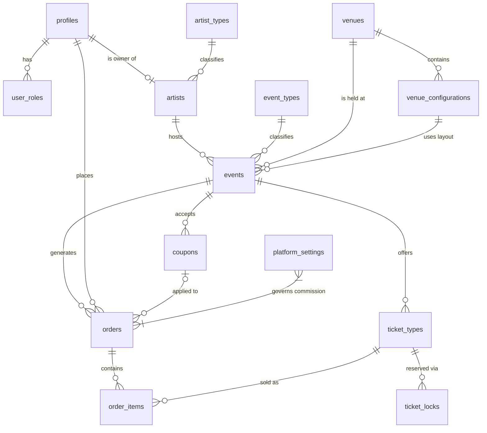

# Database Schema — Supabase / PostgreSQL

> Complete schema for the TicketFlow platform. Both Admin and Store apps share this single Supabase project.

---

## 1. Custom Enum Types

```sql
CREATE TYPE role_type AS ENUM ('admin', 'artist', 'customer');
CREATE TYPE event_status AS ENUM ('draft', 'published', 'cancelled', 'completed');
CREATE TYPE coupon_type AS ENUM ('courtesy', 'percentage', 'fixed');
CREATE TYPE order_status AS ENUM ('pending', 'confirmed', 'cancelled', 'refunded');
```

---

## 2. Table Definitions (DDL)

### Catalogs

```sql
-- Artist type catalog: Music, Comedy, Theatre, etc.
CREATE TABLE artist_types (
    id         UUID PRIMARY KEY DEFAULT gen_random_uuid(),
    name       TEXT NOT NULL,
    slug       TEXT UNIQUE NOT NULL,
    created_at TIMESTAMPTZ DEFAULT now()
);

-- Event type catalog (same taxonomy as artist types)
CREATE TABLE event_types (
    id         UUID PRIMARY KEY DEFAULT gen_random_uuid(),
    name       TEXT NOT NULL,
    slug       TEXT UNIQUE NOT NULL,
    created_at TIMESTAMPTZ DEFAULT now()
);

-- Platform-wide settings (key/value)
-- Example: { key: 'commission_rate', value: 0.20 }
CREATE TABLE platform_settings (
    key         TEXT PRIMARY KEY,
    value       JSONB NOT NULL,
    description TEXT,
    updated_at  TIMESTAMPTZ DEFAULT now()
);
```

### Users & Roles

```sql
-- Extends Supabase auth.users
CREATE TABLE profiles (
    id           UUID PRIMARY KEY REFERENCES auth.users(id) ON DELETE CASCADE,
    display_name TEXT,
    avatar_url   TEXT,
    created_at   TIMESTAMPTZ DEFAULT now(),
    updated_at   TIMESTAMPTZ DEFAULT now()
);

CREATE TABLE user_roles (
    id         UUID PRIMARY KEY DEFAULT gen_random_uuid(),
    user_id    UUID NOT NULL REFERENCES profiles(id) ON DELETE CASCADE,
    role       role_type NOT NULL,
    created_at TIMESTAMPTZ DEFAULT now(),
    UNIQUE(user_id, role)
);
```

### Artists

```sql
CREATE TABLE artists (
    id              UUID PRIMARY KEY DEFAULT gen_random_uuid(),
    user_id         UUID REFERENCES profiles(id) ON DELETE SET NULL,
    name            TEXT NOT NULL,
    photo_url       TEXT,
    description     TEXT,
    artist_type_id  UUID REFERENCES artist_types(id) ON DELETE SET NULL,
    tax_id          TEXT,
    legal_name      TEXT,
    postal_code     TEXT,
    email           TEXT,
    phone_number    TEXT,
    created_at      TIMESTAMPTZ DEFAULT now(),
    created_by      UUID REFERENCES profiles(id),
    updated_at      TIMESTAMPTZ DEFAULT now(),
    updated_by      UUID REFERENCES profiles(id)
);
```

### Venues

```sql
CREATE TABLE venues (
    id          UUID PRIMARY KEY DEFAULT gen_random_uuid(),
    name        TEXT NOT NULL,
    latitude    NUMERIC,
    longitude   NUMERIC,
    map_url     TEXT,      -- Photo/croquis stored in Supabase Storage
    verified    BOOLEAN DEFAULT false,
    created_at  TIMESTAMPTZ DEFAULT now(),
    created_by  UUID REFERENCES profiles(id),
    updated_at  TIMESTAMPTZ DEFAULT now(),
    updated_by  UUID REFERENCES profiles(id)
);

-- A venue can have multiple layout configurations (e.g. Standing, Full Capacity)
-- Each event links to exactly one configuration
CREATE TABLE venue_configurations (
    id          UUID PRIMARY KEY DEFAULT gen_random_uuid(),
    venue_id    UUID NOT NULL REFERENCES venues(id) ON DELETE CASCADE,
    name        TEXT NOT NULL,       -- e.g. 'General', 'Full Capacity', 'Festival'
    description TEXT,
    capacity    INTEGER,
    is_default  BOOLEAN DEFAULT false,
    created_at  TIMESTAMPTZ DEFAULT now(),
    created_by  UUID REFERENCES profiles(id),
    updated_at  TIMESTAMPTZ DEFAULT now(),
    updated_by  UUID REFERENCES profiles(id)
);
```

### Events

```sql
CREATE TABLE events (
    id                     UUID PRIMARY KEY DEFAULT gen_random_uuid(),
    artist_id              UUID NOT NULL REFERENCES artists(id) ON DELETE CASCADE,
    name                   TEXT NOT NULL,
    flyer_url              TEXT,      -- Stored in Supabase Storage bucket: event-flyers
    description            TEXT,
    event_type_id          UUID REFERENCES event_types(id) ON DELETE SET NULL,
    venue_id               UUID REFERENCES venues(id) ON DELETE RESTRICT,
    venue_configuration_id UUID REFERENCES venue_configurations(id) ON DELETE RESTRICT,
    event_date             TIMESTAMPTZ,
    doors_open             TIMESTAMPTZ,
    shared                 BOOLEAN DEFAULT false,   -- Allow other admins to create events with this artist
    status                 event_status DEFAULT 'draft',
    created_at             TIMESTAMPTZ DEFAULT now(),
    created_by             UUID REFERENCES profiles(id),
    updated_at             TIMESTAMPTZ DEFAULT now(),
    updated_by             UUID REFERENCES profiles(id)
);
```

### Ticket Types

```sql
-- Ticket types within a single event; SKU is unique per event
CREATE TABLE ticket_types (
    id          UUID PRIMARY KEY DEFAULT gen_random_uuid(),
    event_id    UUID NOT NULL REFERENCES events(id) ON DELETE CASCADE,
    sku         TEXT NOT NULL,
    name        TEXT NOT NULL,           -- e.g. VIP, General Admission, Balcony
    description TEXT,
    price       NUMERIC NOT NULL CHECK (price >= 0),
    stock       INTEGER NOT NULL CHECK (stock >= 0),
    reserved    INTEGER DEFAULT 0 CHECK (reserved >= 0),  -- Locked for active checkouts
    sold        INTEGER DEFAULT 0 CHECK (sold >= 0),
    is_active   BOOLEAN DEFAULT true,
    created_at  TIMESTAMPTZ DEFAULT now(),
    created_by  UUID REFERENCES profiles(id),
    updated_at  TIMESTAMPTZ DEFAULT now(),
    updated_by  UUID REFERENCES profiles(id),
    UNIQUE(event_id, sku)               -- SKU unique within each event
);
```

### Coupons

```sql
CREATE TABLE coupons (
    id          UUID PRIMARY KEY DEFAULT gen_random_uuid(),
    event_id    UUID REFERENCES events(id) ON DELETE CASCADE,  -- NULL = global coupon
    ticket_sku  TEXT,                         -- NULL = all ticket types in event; set = restricted to SKU
    code        TEXT UNIQUE NOT NULL,
    type        coupon_type NOT NULL,
    value       NUMERIC CHECK (value >= 0),  -- % for percentage, flat for fixed, ignored for courtesy
    max_uses    INTEGER,                      -- NULL = unlimited
    uses_count  INTEGER DEFAULT 0,
    valid_from  TIMESTAMPTZ DEFAULT now(),
    valid_until TIMESTAMPTZ,                  -- NULL = no expiry
    is_active   BOOLEAN DEFAULT true,
    created_at  TIMESTAMPTZ DEFAULT now(),
    created_by  UUID REFERENCES profiles(id),
    updated_at  TIMESTAMPTZ DEFAULT now(),
    updated_by  UUID REFERENCES profiles(id)
);
```

### Orders & Order Items

```sql
CREATE TABLE orders (
    id                UUID PRIMARY KEY DEFAULT gen_random_uuid(),
    customer_id       UUID REFERENCES profiles(id) ON DELETE SET NULL,
    event_id          UUID NOT NULL REFERENCES events(id) ON DELETE RESTRICT,
    status            order_status DEFAULT 'pending',
    coupon_id         UUID REFERENCES coupons(id) ON DELETE SET NULL,
    subtotal          NUMERIC NOT NULL CHECK (subtotal >= 0),
    discount_amount   NUMERIC DEFAULT 0 CHECK (discount_amount >= 0),
    commission_amount NUMERIC NOT NULL CHECK (commission_amount >= 0),
    total             NUMERIC NOT NULL CHECK (total >= 0),
    payment_provider  TEXT DEFAULT 'paypal',
    payment_reference TEXT,   -- PayPal transaction/order ID
    created_at        TIMESTAMPTZ DEFAULT now(),
    updated_at        TIMESTAMPTZ DEFAULT now()
);

CREATE TABLE order_items (
    id                UUID PRIMARY KEY DEFAULT gen_random_uuid(),
    order_id          UUID NOT NULL REFERENCES orders(id) ON DELETE CASCADE,
    ticket_type_id    UUID NOT NULL REFERENCES ticket_types(id) ON DELETE RESTRICT,
    quantity          INTEGER NOT NULL CHECK (quantity > 0),
    unit_price        NUMERIC NOT NULL CHECK (unit_price >= 0),
    commission_rate   NUMERIC NOT NULL CHECK (commission_rate >= 0),   -- Snapshot at purchase time
    commission_amount NUMERIC NOT NULL CHECK (commission_amount >= 0),
    total             NUMERIC NOT NULL CHECK (total >= 0)
);
```

### Ticket Locks (Reservation)

```sql
-- Holds inventory during 15-minute checkout window
CREATE TABLE ticket_locks (
    id              UUID PRIMARY KEY DEFAULT gen_random_uuid(),
    ticket_type_id  UUID NOT NULL REFERENCES ticket_types(id) ON DELETE CASCADE,
    session_id      TEXT NOT NULL,      -- Anonymous or user session identifier
    quantity        INTEGER NOT NULL CHECK (quantity > 0),
    locked_until    TIMESTAMPTZ NOT NULL,   -- now() + interval '15 minutes'
    created_at      TIMESTAMPTZ DEFAULT now()
);
```

---

## 3. Key Indexes

```sql
CREATE INDEX idx_artists_user_id ON artists(user_id);
CREATE INDEX idx_events_artist_id ON events(artist_id);
CREATE INDEX idx_events_venue_id ON events(venue_id);
CREATE INDEX idx_events_status ON events(status);
CREATE INDEX idx_events_event_date ON events(event_date);
CREATE INDEX idx_ticket_types_event_id ON ticket_types(event_id);
CREATE INDEX idx_orders_customer_id ON orders(customer_id);
CREATE INDEX idx_orders_event_id ON orders(event_id);
CREATE INDEX idx_orders_status ON orders(status);
CREATE INDEX idx_ticket_locks_locked_until ON ticket_locks(locked_until);
CREATE INDEX idx_ticket_locks_session_id ON ticket_locks(session_id);
CREATE INDEX idx_coupons_code ON coupons(code);
```

---

## 4. Row Level Security (RLS) Policies

```sql
-- Enable RLS on all tables
ALTER TABLE artist_types ENABLE ROW LEVEL SECURITY;
ALTER TABLE event_types ENABLE ROW LEVEL SECURITY;
ALTER TABLE platform_settings ENABLE ROW LEVEL SECURITY;
ALTER TABLE profiles ENABLE ROW LEVEL SECURITY;
ALTER TABLE user_roles ENABLE ROW LEVEL SECURITY;
ALTER TABLE artists ENABLE ROW LEVEL SECURITY;
ALTER TABLE venues ENABLE ROW LEVEL SECURITY;
ALTER TABLE venue_configurations ENABLE ROW LEVEL SECURITY;
ALTER TABLE events ENABLE ROW LEVEL SECURITY;
ALTER TABLE ticket_types ENABLE ROW LEVEL SECURITY;
ALTER TABLE coupons ENABLE ROW LEVEL SECURITY;
ALTER TABLE orders ENABLE ROW LEVEL SECURITY;
ALTER TABLE order_items ENABLE ROW LEVEL SECURITY;
ALTER TABLE ticket_locks ENABLE ROW LEVEL SECURITY;

-- Helper function: check if current user has a given role
CREATE OR REPLACE FUNCTION has_role(r role_type) RETURNS boolean AS $$
  SELECT EXISTS (SELECT 1 FROM user_roles WHERE user_id = auth.uid() AND role = r);
$$ LANGUAGE sql SECURITY DEFINER STABLE;

-- ---------------------------------------------------------------
-- Catalogs (artist_types, event_types): public read, admin write
-- ---------------------------------------------------------------
CREATE POLICY "Public read artist_types" ON artist_types FOR SELECT USING (true);
CREATE POLICY "Admin write artist_types" ON artist_types FOR ALL USING (has_role('admin'));

CREATE POLICY "Public read event_types" ON event_types FOR SELECT USING (true);
CREATE POLICY "Admin write event_types" ON event_types FOR ALL USING (has_role('admin'));

-- ---------------------------------------------------------------
-- platform_settings: public read, admin write
-- ---------------------------------------------------------------
CREATE POLICY "Public read settings" ON platform_settings FOR SELECT USING (true);
CREATE POLICY "Admin write settings" ON platform_settings FOR ALL USING (has_role('admin'));

-- ---------------------------------------------------------------
-- profiles: own row read/update; admin read all
-- ---------------------------------------------------------------
CREATE POLICY "Users read own profile" ON profiles FOR SELECT USING (auth.uid() = id);
CREATE POLICY "Users update own profile" ON profiles FOR UPDATE USING (auth.uid() = id);
CREATE POLICY "Admin read all profiles" ON profiles FOR SELECT USING (has_role('admin'));

-- ---------------------------------------------------------------
-- user_roles: own row read; admin all
-- ---------------------------------------------------------------
CREATE POLICY "Users read own roles" ON user_roles FOR SELECT USING (user_id = auth.uid());
CREATE POLICY "Admin manage roles" ON user_roles FOR ALL USING (has_role('admin'));

-- ---------------------------------------------------------------
-- artists: public read; artist manages own; admin manages all
-- ---------------------------------------------------------------
CREATE POLICY "Public read artists" ON artists FOR SELECT USING (true);
CREATE POLICY "Artist manage own" ON artists FOR ALL USING (user_id = auth.uid());
CREATE POLICY "Admin manage all artists" ON artists FOR ALL USING (has_role('admin'));

-- ---------------------------------------------------------------
-- venues: public read; authenticated create; owner/admin update
-- verified can only be set to true by admin
-- ---------------------------------------------------------------
CREATE POLICY "Public read venues" ON venues FOR SELECT USING (true);
CREATE POLICY "Auth create venue" ON venues FOR INSERT WITH CHECK (auth.uid() IS NOT NULL);
CREATE POLICY "Creator or admin update venue" ON venues FOR UPDATE
  USING (created_by = auth.uid() OR has_role('admin'));
CREATE POLICY "Admin delete venue" ON venues FOR DELETE USING (has_role('admin'));

CREATE POLICY "Public read venue_configurations" ON venue_configurations FOR SELECT USING (true);
CREATE POLICY "Auth create venue_config" ON venue_configurations FOR INSERT
  WITH CHECK (auth.uid() IS NOT NULL);
CREATE POLICY "Creator or admin update venue_config" ON venue_configurations FOR UPDATE
  USING (created_by = auth.uid() OR has_role('admin'));

-- ---------------------------------------------------------------
-- events: public read published; artist manages own; admin all
-- ---------------------------------------------------------------
CREATE POLICY "Public read published events" ON events FOR SELECT USING (status = 'published');
CREATE POLICY "Artist read own events" ON events FOR SELECT
  USING (artist_id IN (SELECT id FROM artists WHERE user_id = auth.uid()));
CREATE POLICY "Artist manage own events" ON events FOR ALL
  USING (artist_id IN (SELECT id FROM artists WHERE user_id = auth.uid()));
CREATE POLICY "Admin manage all events" ON events FOR ALL USING (has_role('admin'));

-- ---------------------------------------------------------------
-- ticket_types: public read active for published events; artist manages own
-- ---------------------------------------------------------------
CREATE POLICY "Public read active ticket_types" ON ticket_types FOR SELECT
  USING (is_active = true AND event_id IN (SELECT id FROM events WHERE status = 'published'));
CREATE POLICY "Artist manage own ticket_types" ON ticket_types FOR ALL
  USING (event_id IN (
    SELECT e.id FROM events e
    JOIN artists a ON a.id = e.artist_id
    WHERE a.user_id = auth.uid()
  ));
CREATE POLICY "Admin manage all ticket_types" ON ticket_types FOR ALL USING (has_role('admin'));

-- ---------------------------------------------------------------
-- coupons: artist manages own; authenticated read (for validation)
-- ---------------------------------------------------------------
CREATE POLICY "Auth read coupons" ON coupons FOR SELECT USING (auth.uid() IS NOT NULL);
CREATE POLICY "Artist manage own coupons" ON coupons FOR ALL
  USING (event_id IN (
    SELECT e.id FROM events e
    JOIN artists a ON a.id = e.artist_id
    WHERE a.user_id = auth.uid()
  ));
CREATE POLICY "Admin manage all coupons" ON coupons FOR ALL USING (has_role('admin'));

-- ---------------------------------------------------------------
-- orders: customer reads/creates own; artist reads orders for their events
-- ---------------------------------------------------------------
CREATE POLICY "Customer own orders" ON orders FOR ALL USING (customer_id = auth.uid());
CREATE POLICY "Artist read event orders" ON orders FOR SELECT
  USING (event_id IN (
    SELECT e.id FROM events e
    JOIN artists a ON a.id = e.artist_id
    WHERE a.user_id = auth.uid()
  ));
CREATE POLICY "Admin all orders" ON orders FOR ALL USING (has_role('admin'));

CREATE POLICY "Customer own order_items" ON order_items FOR SELECT
  USING (order_id IN (SELECT id FROM orders WHERE customer_id = auth.uid()));
CREATE POLICY "System insert order_items" ON order_items FOR INSERT
  WITH CHECK (order_id IN (SELECT id FROM orders WHERE customer_id = auth.uid()));

-- ---------------------------------------------------------------
-- ticket_locks: session-based insert; system cleanup
-- ---------------------------------------------------------------
CREATE POLICY "Auth insert lock" ON ticket_locks FOR INSERT WITH CHECK (auth.uid() IS NOT NULL);
CREATE POLICY "Session read own locks" ON ticket_locks FOR SELECT USING (auth.uid() IS NOT NULL);
CREATE POLICY "System delete expired locks" ON ticket_locks FOR DELETE USING (true);
```

---

## 5. Triggers & Functions

```sql
-- Auto-create profile row on new auth user
CREATE OR REPLACE FUNCTION handle_new_user()
RETURNS TRIGGER AS $$
BEGIN
  INSERT INTO public.profiles (id, display_name)
  VALUES (NEW.id, NEW.raw_user_meta_data->>'full_name');
  RETURN NEW;
END;
$$ LANGUAGE plpgsql SECURITY DEFINER;

CREATE TRIGGER on_auth_user_created
  AFTER INSERT ON auth.users
  FOR EACH ROW EXECUTE FUNCTION handle_new_user();

-- Auto-update updated_at timestamp
CREATE OR REPLACE FUNCTION update_updated_at()
RETURNS TRIGGER AS $$
BEGIN
  NEW.updated_at = now();
  RETURN NEW;
END;
$$ LANGUAGE plpgsql;

-- Apply to all auditable tables
CREATE TRIGGER trg_profiles_updated_at BEFORE UPDATE ON profiles FOR EACH ROW EXECUTE FUNCTION update_updated_at();
CREATE TRIGGER trg_artists_updated_at BEFORE UPDATE ON artists FOR EACH ROW EXECUTE FUNCTION update_updated_at();
CREATE TRIGGER trg_events_updated_at BEFORE UPDATE ON events FOR EACH ROW EXECUTE FUNCTION update_updated_at();
CREATE TRIGGER trg_venues_updated_at BEFORE UPDATE ON venues FOR EACH ROW EXECUTE FUNCTION update_updated_at();
CREATE TRIGGER trg_ticket_types_updated_at BEFORE UPDATE ON ticket_types FOR EACH ROW EXECUTE FUNCTION update_updated_at();
CREATE TRIGGER trg_coupons_updated_at BEFORE UPDATE ON coupons FOR EACH ROW EXECUTE FUNCTION update_updated_at();
CREATE TRIGGER trg_orders_updated_at BEFORE UPDATE ON orders FOR EACH ROW EXECUTE FUNCTION update_updated_at();

-- Atomic ticket reservation function
CREATE OR REPLACE FUNCTION reserve_tickets(
  p_ticket_type_id UUID,
  p_quantity INT,
  p_session_id TEXT
) RETURNS JSONB AS $$
DECLARE
  v_available INT;
  v_lock_id UUID;
  v_locked_until TIMESTAMPTZ;
BEGIN
  -- Check available stock with lock
  SELECT (stock - sold - reserved) INTO v_available
  FROM ticket_types
  WHERE id = p_ticket_type_id
  FOR UPDATE;

  IF v_available < p_quantity THEN
    RETURN jsonb_build_object('success', false, 'error', 'insufficient_stock', 'available', v_available);
  END IF;

  -- Create lock
  v_locked_until := now() + INTERVAL '15 minutes';
  INSERT INTO ticket_locks (ticket_type_id, session_id, quantity, locked_until)
  VALUES (p_ticket_type_id, p_session_id, p_quantity, v_locked_until)
  RETURNING id INTO v_lock_id;

  -- Increment reserved
  UPDATE ticket_types SET reserved = reserved + p_quantity WHERE id = p_ticket_type_id;

  RETURN jsonb_build_object(
    'success', true,
    'lock_id', v_lock_id,
    'locked_until', v_locked_until
  );
END;
$$ LANGUAGE plpgsql;

-- Release a single ticket lock
CREATE OR REPLACE FUNCTION release_ticket_lock(p_lock_id UUID) RETURNS void AS $$
DECLARE
  v_ticket_type_id UUID;
  v_quantity INT;
BEGIN
  SELECT ticket_type_id, quantity INTO v_ticket_type_id, v_quantity
  FROM ticket_locks WHERE id = p_lock_id;

  IF FOUND THEN
    DELETE FROM ticket_locks WHERE id = p_lock_id;
    UPDATE ticket_types SET reserved = GREATEST(0, reserved - v_quantity)
    WHERE id = v_ticket_type_id;
  END IF;
END;
$$ LANGUAGE plpgsql;

-- Release all expired locks (called by pg_cron every minute)
CREATE OR REPLACE FUNCTION release_expired_locks() RETURNS INT AS $$
DECLARE
  v_count INT;
BEGIN
  WITH expired AS (
    DELETE FROM ticket_locks
    WHERE locked_until < now()
    RETURNING ticket_type_id, quantity
  )
  UPDATE ticket_types tt
  SET reserved = GREATEST(0, tt.reserved - e.total_qty)
  FROM (
    SELECT ticket_type_id, SUM(quantity) AS total_qty
    FROM expired
    GROUP BY ticket_type_id
  ) e
  WHERE tt.id = e.ticket_type_id;

  GET DIAGNOSTICS v_count = ROW_COUNT;
  RETURN v_count;
END;
$$ LANGUAGE plpgsql;
```

---

## 6. Supabase Storage Buckets

| Bucket | Access | Max Size | Allowed Types |
|--------|--------|----------|---------------|
| `artist-photos` | Public read, auth write | 5 MB | image/jpeg, image/png, image/webp |
| `event-flyers` | Public read, auth write | 10 MB | image/jpeg, image/png, image/webp |
| `venue-maps` | Public read, auth write | 20 MB | image/jpeg, image/png, application/pdf |

Storage RLS policies ensure only the owning artist can upload to their paths (e.g., `artist-photos/{user_id}/*`).

---

## 7. Seed Data

```sql
-- Catalog seed
INSERT INTO artist_types (name, slug) VALUES
  ('Music', 'music'),
  ('Comedy', 'comedy'),
  ('Theatre', 'theatre'),
  ('Dance', 'dance'),
  ('Sports', 'sports'),
  ('Conference', 'conference'),
  ('Festival', 'festival'),
  ('Other', 'other');

INSERT INTO event_types (name, slug) VALUES
  ('Concert', 'concert'),
  ('Stand-up Comedy', 'standup'),
  ('Play', 'play'),
  ('Dance Show', 'dance-show'),
  ('Sports Event', 'sports'),
  ('Conference', 'conference'),
  ('Festival', 'festival'),
  ('Other', 'other');

INSERT INTO platform_settings (key, value, description) VALUES
  ('commission_rate', '0.20', 'Platform commission rate applied to all ticket sales'),
  ('lock_duration_minutes', '15', 'Minutes a ticket reservation lock is held during checkout');
```

---

## 8. Entity Relationship Diagram



---

## 9. Ticket Lock Mechanism

The platform uses **optimistic inventory reservation** to prevent overselling while allowing a smooth checkout UX.

### Flow

```
1. Customer selects tickets on Event Detail page
2. "Add to Cart" → calls reserve_tickets() for each ticket type
   ├── Checks: stock - sold - reserved >= requested quantity
   ├── If OK: inserts ticket_locks row + increments reserved
   └── If not: returns 'insufficient_stock' error → show "Sold Out"
3. Customer has 15 minutes to complete checkout
4. Countdown timer shown in UI
5a. Checkout completed:
    └── Edge Function: increment sold, decrement reserved, delete lock
5b. Checkout cancelled/abandoned:
    └── Client or pg_cron: release_ticket_lock() → decrement reserved, delete lock
5c. Lock expires:
    └── pg_cron every minute: release_expired_locks() → decrement reserved, delete expired locks
```

### Available Stock Formula

```
available = stock - sold - reserved
```

- `stock` = total tickets created by artist
- `sold` = confirmed purchases
- `reserved` = currently locked (active checkouts)

---

## 10. SKU Design

- SKU is **unique per event** (`UNIQUE(event_id, sku)`)
- Same SKU (e.g. `GA-001`, `VIP`) can exist across different events
- Auto-suggestion in Admin UI: `{event-slug}-{sequence}` (e.g. `coldplay-mx-001`)
- Artists can freely edit the SKU before any tickets are sold
