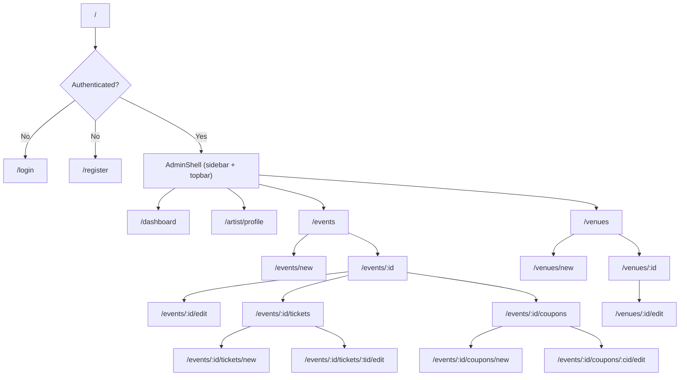
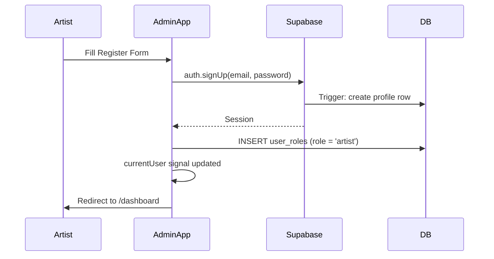
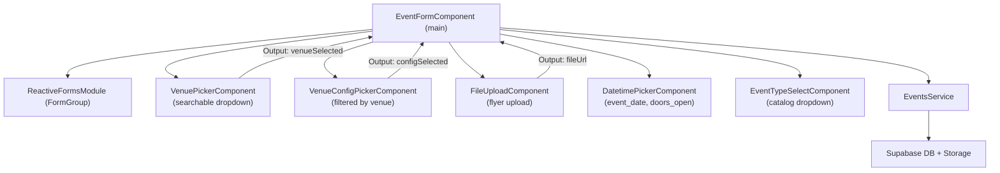

# Admin App Blueprint

> Artist-facing management portal. Angular 18+ standalone components, TailwindCSS, Supabase.

---

## Design Palette

| Token | Hex | Usage in Admin App |
|-------|-----|--------------------|
| `primary` | `#0bdef5` | Sidebar active indicator, links, focus rings |
| `surface` | `#fff3f0` | Text/icons on dark sidebar |
| `accent` | `#f7e733` | Dashboard KPI numbers, Published event badge |
| `dark` | `#150811` | Sidebar background, body text |
| `contrast` | `#e11392` | Delete buttons, Cancelled status badge, danger alerts |

---

## Architecture

**Vertical Slicing** — each feature owns all its layers:
```
features/events/
├── event-list/          # Component (standalone)
├── event-form/          # Component (standalone)
├── event-detail/        # Component (standalone)
├── events.service.ts    # Supabase calls, typed
├── event.model.ts       # TypeScript interfaces
└── events.routes.ts     # loadComponent / loadChildren
```

No NgModules anywhere. `standalone: true` on every component. Angular Signals for state.

---

## App File Structure

```
apps/admin/src/
├── app/
│   ├── app.component.ts       # Root shell — layout + router-outlet
│   ├── app.config.ts          # provideRouter, provideHttpClient, provideSupabase
│   └── app.routes.ts          # Top-level lazy routes
├── features/
│   ├── auth/
│   │   ├── login/
│   │   │   └── login.component.ts
│   │   ├── register/
│   │   │   └── register.component.ts
│   │   └── auth.service.ts
│   ├── dashboard/
│   │   ├── dashboard.component.ts
│   │   └── dashboard.service.ts
│   ├── artists/
│   │   ├── artist-detail/
│   │   │   └── artist-detail.component.ts
│   │   ├── artist-form/
│   │   │   └── artist-form.component.ts
│   │   ├── artists.service.ts
│   │   ├── artists.routes.ts
│   │   └── artist.model.ts
│   ├── events/
│   │   ├── event-list/
│   │   │   └── event-list.component.ts
│   │   ├── event-form/
│   │   │   └── event-form.component.ts
│   │   ├── event-detail/
│   │   │   └── event-detail.component.ts
│   │   ├── events.service.ts
│   │   ├── events.routes.ts
│   │   └── event.model.ts
│   ├── venues/
│   │   ├── venue-list/
│   │   │   └── venue-list.component.ts
│   │   ├── venue-form/
│   │   │   └── venue-form.component.ts
│   │   ├── venue-detail/
│   │   │   └── venue-detail.component.ts
│   │   ├── venue-picker/
│   │   │   └── venue-picker.component.ts     # Reusable in event form
│   │   ├── venue-config-form/
│   │   │   └── venue-config-form.component.ts
│   │   ├── venues.service.ts
│   │   ├── venues.routes.ts
│   │   └── venue.model.ts
│   └── tickets/
│       ├── ticket-type-list/
│       │   └── ticket-type-list.component.ts
│       ├── ticket-type-form/
│       │   └── ticket-type-form.component.ts
│       ├── coupon-list/
│       │   └── coupon-list.component.ts
│       ├── coupon-form/
│       │   └── coupon-form.component.ts
│       ├── tickets.service.ts
│       ├── tickets.routes.ts
│       └── ticket.model.ts
└── shared/
    ├── layout/
    │   ├── admin-shell.component.ts    # Sidebar + topbar wrapper
    │   ├── sidebar.component.ts
    │   └── topbar.component.ts
    ├── ui/
    │   ├── button.component.ts
    │   ├── card.component.ts
    │   ├── badge.component.ts
    │   ├── stat-card.component.ts
    │   ├── file-upload.component.ts
    │   └── map-picker.component.ts     # Google Maps coordinate picker
    └── guards/
        ├── auth.guard.ts               # Redirect to /login if no session
        ├── no-auth.guard.ts            # Redirect logged-in users away from /login
        └── artist-role.guard.ts        # Check user_roles for 'artist' or 'admin'
```

---

## Route Structure

| Path | Component | Guard | Description |
|------|-----------|-------|-------------|
| `/login` | `LoginComponent` | `noAuthGuard` | Artist login |
| `/register` | `RegisterComponent` | `noAuthGuard` | Artist registration |
| `/dashboard` | `DashboardComponent` | `authGuard` | Stats overview |
| `/artist/profile` | `ArtistDetailComponent` | `authGuard` | View/edit artist profile |
| `/events` | `EventListComponent` | `authGuard` | List artist's events |
| `/events/new` | `EventFormComponent` | `authGuard` | Create new event |
| `/events/:id` | `EventDetailComponent` | `authGuard` | Event detail |
| `/events/:id/edit` | `EventFormComponent` | `authGuard` | Edit event |
| `/events/:id/tickets` | `TicketTypeListComponent` | `authGuard` | Event ticket types |
| `/events/:id/tickets/new` | `TicketTypeFormComponent` | `authGuard` | Add ticket type |
| `/events/:id/tickets/:tid/edit` | `TicketTypeFormComponent` | `authGuard` | Edit ticket type |
| `/events/:id/coupons` | `CouponListComponent` | `authGuard` | Event coupons |
| `/events/:id/coupons/new` | `CouponFormComponent` | `authGuard` | Create coupon |
| `/events/:id/coupons/:cid/edit` | `CouponFormComponent` | `authGuard` | Edit coupon |
| `/venues` | `VenueListComponent` | `authGuard` | Browse venues |
| `/venues/new` | `VenueFormComponent` | `authGuard` | Create venue |
| `/venues/:id` | `VenueDetailComponent` | `authGuard` | Venue detail + configurations |
| `/venues/:id/edit` | `VenueFormComponent` | `authGuard` | Edit venue |

### Routing Tree



---

## Feature Breakdowns

### Feature 1: Auth

**Purpose:** Register and authenticate artist users.

#### Components

| Component | Description |
|-----------|-------------|
| `LoginComponent` | Email + password, link to register |
| `RegisterComponent` | Name, email, password, confirm password |

#### Auth Service

```typescript
@Injectable({ providedIn: 'root' })
export class AuthService {
  private supabase = inject(SupabaseService).client;
  readonly currentUser = signal<User | null>(null);
  readonly isLoading = signal(false);

  constructor() {
    // Subscribe to Supabase auth state changes
    this.supabase.auth.onAuthStateChange((event, session) => {
      this.currentUser.set(session?.user ?? null);
    });
  }

  async register(displayName: string, email: string, password: string): Promise<void> {
    // 1. supabase.auth.signUp({ email, password, options: { data: { full_name } } })
    // 2. Trigger on_auth_user_created creates profile automatically
    // 3. Insert into user_roles: { user_id, role: 'artist' }
  }

  async login(email: string, password: string): Promise<void> {
    // supabase.auth.signInWithPassword({ email, password })
  }

  async logout(): Promise<void> {
    // supabase.auth.signOut()
  }

  async getCurrentArtistId(): Promise<string | null> {
    // SELECT id FROM artists WHERE user_id = auth.uid() LIMIT 1
  }
}
```

#### Auth Flow



#### Guards

```typescript
// auth.guard.ts
export const authGuard: CanActivateFn = () => {
  const auth = inject(AuthService);
  const router = inject(Router);
  return auth.currentUser() ? true : router.parseUrl('/login');
};

// no-auth.guard.ts — prevents logged-in users visiting /login
export const noAuthGuard: CanActivateFn = () => {
  const auth = inject(AuthService);
  const router = inject(Router);
  return !auth.currentUser() ? true : router.parseUrl('/dashboard');
};
```

---

### Feature 2: Dashboard

**Purpose:** High-level stats summary for the logged-in artist.

#### Dashboard Service

```typescript
@Injectable({ providedIn: 'root' })
export class DashboardService {
  async getStats(artistId: string): Promise<DashboardStats> {
    // Parallel queries:
    // - COUNT events by status (draft, published, completed, cancelled)
    // - SUM order_items.quantity WHERE order status = confirmed (tickets sold)
    // - SUM orders.total - orders.commission_amount (net revenue to artist)
    // - SELECT upcoming events (status=published, event_date > now(), LIMIT 5)
  }
}

interface DashboardStats {
  totalEvents: number;
  publishedEvents: number;
  draftEvents: number;
  ticketsSold: number;
  ticketsAvailable: number;
  netRevenue: number;
  upcomingEvents: EventSummary[];
}
```

#### UI Notes
- 4-card row at top: Events, Tickets Sold, Available, Net Revenue
- All KPI numbers use `accent` (`#f7e733`) for maximum visibility
- Upcoming events table below the stat cards
- "Create Event" CTA in `primary` (`#0bdef5`)

---

### Feature 3: Artists (Profile Management)

**Purpose:** An artist manages their own profile (1:1 with their user account).

#### Fields & Validation

| Field | Required | Notes |
|-------|----------|-------|
| name | ✅ | Display name |
| photo_url | — | Upload to `artist-photos` bucket |
| description | — | Textarea, max 2000 chars |
| artist_type_id | ✅ | Dropdown from `artist_types` catalog |
| tax_id | — | Text, no format enforcement in MVP |
| legal_name | — | Full legal name for billing |
| postal_code | — | Text |
| email | ✅ | Valid email format |
| phone_number | — | Text |

#### Artists Service

```typescript
export class ArtistsService {
  async getMyArtistProfile(userId: string): Promise<Artist | null>
  // SELECT * FROM artists WHERE user_id = userId LIMIT 1

  async createArtistProfile(data: CreateArtistDto): Promise<Artist>
  // INSERT INTO artists (user_id, ...data)

  async updateArtistProfile(id: string, data: UpdateArtistDto): Promise<Artist>
  // UPDATE artists SET ...data WHERE id = id

  async uploadPhoto(file: File, artistId: string): Promise<string>
  // supabase.storage.from('artist-photos').upload(`${artistId}/photo`, file)
  // Returns public URL

  async getArtistTypes(): Promise<ArtistType[]>
  // SELECT * FROM artist_types ORDER BY name
}
```

---

### Feature 4: Events

**Purpose:** Full CRUD for events belonging to the logged-in artist.

#### Event Form Fields

| Field | Control | Validation |
|-------|---------|------------|
| name | Text input | Required, max 200 |
| description | Textarea | Max 5000 |
| flyer | File upload | image/*, max 10MB |
| event_type_id | Select | Required |
| venue_id | VenuePickerComponent | Required |
| venue_configuration_id | Select (filtered) | Required after venue selected |
| event_date | Datetime picker | Required, must be future |
| doors_open | Datetime picker | Must be before event_date |
| shared | Toggle | Default: false |
| status | Status control | Draft → Published workflow |

#### Events Service

```typescript
export class EventsService {
  async getMyEvents(artistId: string): Promise<Event[]>
  // SELECT * FROM events WHERE artist_id = artistId ORDER BY event_date DESC

  async getEvent(id: string): Promise<EventDetail>
  // SELECT events.*, venues.*, venue_configurations.*, artists.* WHERE events.id = id

  async createEvent(data: CreateEventDto, flyer?: File): Promise<Event>
  // 1. Upload flyer if provided → get URL
  // 2. INSERT INTO events { ...data, flyer_url, artist_id }

  async updateEvent(id: string, data: UpdateEventDto, flyer?: File): Promise<Event>

  async publishEvent(id: string): Promise<void>
  // UPDATE events SET status = 'published' WHERE id = id

  async deleteEvent(id: string): Promise<void>
  // Only allowed if status = 'draft' and no confirmed orders

  async uploadFlyer(file: File, eventId: string): Promise<string>
  // supabase.storage.from('event-flyers').upload(...)
}
```

#### Event Status Badges (Design)
| Status | Color |
|--------|-------|
| `draft` | Gray |
| `published` | `#f7e733` (accent/yellow) |
| `cancelled` | `#e11392` (contrast/magenta) |
| `completed` | `#0bdef5` (primary/cyan) |

#### Event Form Component Interaction



---

### Feature 5: Venues

**Purpose:** Browse existing venues and create new ones. Venue configurations are managed within venue detail.

#### Venue Form Fields

| Field | Control | Validation |
|-------|---------|------------|
| name | Text input | Required |
| latitude / longitude | MapPickerComponent | Required |
| map_url | File upload | image/* or PDF, max 20MB |
| verified | Toggle | Admin-only |

#### Venue Configurations (sub-feature)
Displayed as a list within venue detail. Each configuration:
- name (e.g. "General Admission", "Full Capacity")
- description
- capacity (integer)
- is_default toggle

#### Venues Service

```typescript
export class VenuesService {
  async getVenues(query?: string): Promise<Venue[]>
  // SELECT * FROM venues WHERE name ILIKE '%query%' ORDER BY verified DESC, name

  async getVenue(id: string): Promise<VenueDetail>
  // Includes venue_configurations

  async createVenue(data: CreateVenueDto, mapFile?: File): Promise<Venue>

  async updateVenue(id: string, data: UpdateVenueDto): Promise<Venue>

  async getConfigurations(venueId: string): Promise<VenueConfiguration[]>

  async createConfiguration(data: CreateConfigDto): Promise<VenueConfiguration>

  async updateConfiguration(id: string, data: UpdateConfigDto): Promise<VenueConfiguration>

  async deleteConfiguration(id: string): Promise<void>
}
```

#### Venue Picker Component (reused in Event Form)

```typescript
@Component({
  selector: 'admin-venue-picker',
  standalone: true,
  // Search input with debounce → calls VenuesService.getVenues(query)
  // Shows results list with: name, verified badge (cyan), city
  // Emits selected venue
})
export class VenuePickerComponent {
  @Output() venueSelected = new EventEmitter<Venue>();
  // Option to open "Create new venue" in a side panel or modal
}
```

---

### Feature 6: Tickets & Coupons

#### Ticket Types

**Purpose:** Define the pricing tiers for an event.

**Form Fields:**

| Field | Validation | Notes |
|-------|------------|-------|
| sku | Required, unique per event | Auto-suggested, editable |
| name | Required | e.g. "VIP Front Row" |
| description | Optional | What's included |
| price | Required, >= 0 | Numeric |
| stock | Required, > 0 | Total quantity |
| is_active | Toggle | Can hide without deleting |

**Commission Display:**
```
Base price:    $500.00
Commission:   -$100.00  (20%)
Artist receives: $400.00
```

#### Tickets Service

```typescript
export class TicketsService {
  async getTicketTypes(eventId: string): Promise<TicketType[]>
  async createTicketType(data: CreateTicketTypeDto): Promise<TicketType>
  async updateTicketType(id: string, data: UpdateTicketTypeDto): Promise<TicketType>
  async deactivateTicketType(id: string): Promise<void>
  async validateSkuUniqueness(eventId: string, sku: string, excludeId?: string): Promise<boolean>
  // SELECT COUNT(*) FROM ticket_types WHERE event_id = eventId AND sku = sku AND id != excludeId

  async getCommissionRate(): Promise<number>
  // SELECT value FROM platform_settings WHERE key = 'commission_rate'
}
```

#### Coupons

**Form Fields:**

| Field | Validation | Notes |
|-------|------------|-------|
| code | Required, unique | Auto-generator button |
| type | Required | courtesy / percentage / fixed |
| value | Conditional | Required for percentage/fixed |
| max_uses | Optional | Blank = unlimited |
| valid_from | Required | Default: now |
| valid_until | Optional | Blank = no expiry |
| is_active | Toggle | |

**Coupon Types:**
- `courtesy` → 100% off (ignores `value`)
- `percentage` → `value`% off subtotal (0-100)
- `fixed` → flat `value` deducted from subtotal

```typescript
export class CouponsService {
  async getCoupons(eventId: string): Promise<Coupon[]>
  async createCoupon(data: CreateCouponDto): Promise<Coupon>
  async updateCoupon(id: string, data: UpdateCouponDto): Promise<Coupon>
  async deactivateCoupon(id: string): Promise<void>
  async generateCode(): string
  // Math.random().toString(36).substring(2, 10).toUpperCase()
}
```

---

## Shared Layout

### Sidebar Navigation

```
[TF Logo]
─────────────────
📊 Dashboard
👤 Artist Profile
🎭 Events
   └─ (when on event) Ticket Types
                      Coupons
📍 Venues
─────────────────
[Avatar + Logout]
```

- Background: `dark` (`#150811`)
- Text: `surface` (`#fff3f0`)
- Active item: left border `4px solid #0bdef5`, text `#0bdef5`
- Hover: subtle `#ffffff11` overlay
- Collapsible on mobile with hamburger icon

### TopBar
- App title / breadcrumb
- User avatar → dropdown: My Profile, Logout
- Background: white, bottom border subtle

---

## TypeScript Models

```typescript
// artist.model.ts
export interface Artist {
  id: string;
  user_id: string;
  name: string;
  photo_url: string | null;
  description: string | null;
  artist_type_id: string | null;
  artist_type?: ArtistType;
  tax_id: string | null;
  legal_name: string | null;
  postal_code: string | null;
  email: string;
  phone_number: string | null;
  created_at: string;
  updated_at: string;
}

// event.model.ts
export interface Event {
  id: string;
  artist_id: string;
  name: string;
  flyer_url: string | null;
  description: string | null;
  event_type_id: string | null;
  venue_id: string | null;
  venue_configuration_id: string | null;
  event_date: string | null;
  doors_open: string | null;
  shared: boolean;
  status: 'draft' | 'published' | 'cancelled' | 'completed';
  created_at: string;
  updated_at: string;
  // Joined
  venue?: Venue;
  venue_configuration?: VenueConfiguration;
  event_type?: EventType;
  artist?: Artist;
}

// ticket.model.ts
export interface TicketType {
  id: string;
  event_id: string;
  sku: string;
  name: string;
  description: string | null;
  price: number;
  stock: number;
  reserved: number;
  sold: number;
  is_active: boolean;
  created_at: string;
  updated_at: string;
}

export interface Coupon {
  id: string;
  event_id: string | null;
  code: string;
  type: 'courtesy' | 'percentage' | 'fixed';
  value: number | null;
  max_uses: number | null;
  uses_count: number;
  valid_from: string;
  valid_until: string | null;
  is_active: boolean;
}
```
