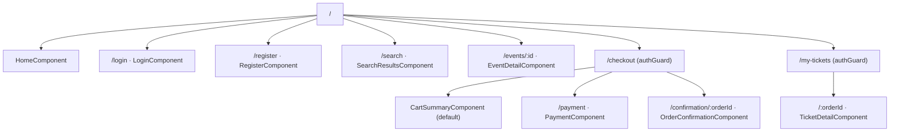
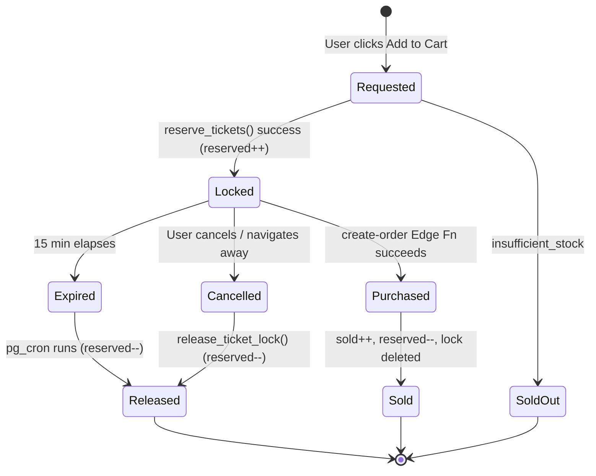
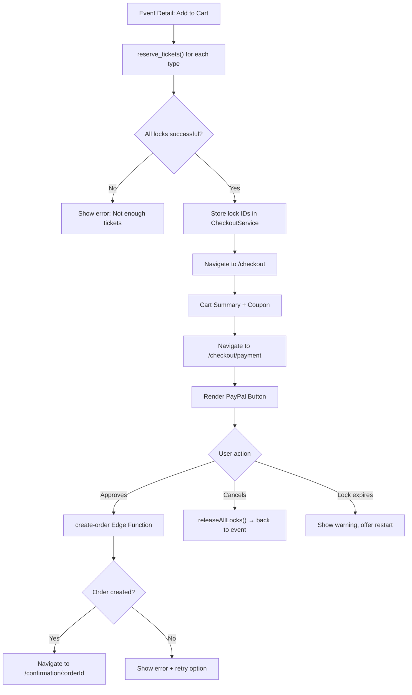
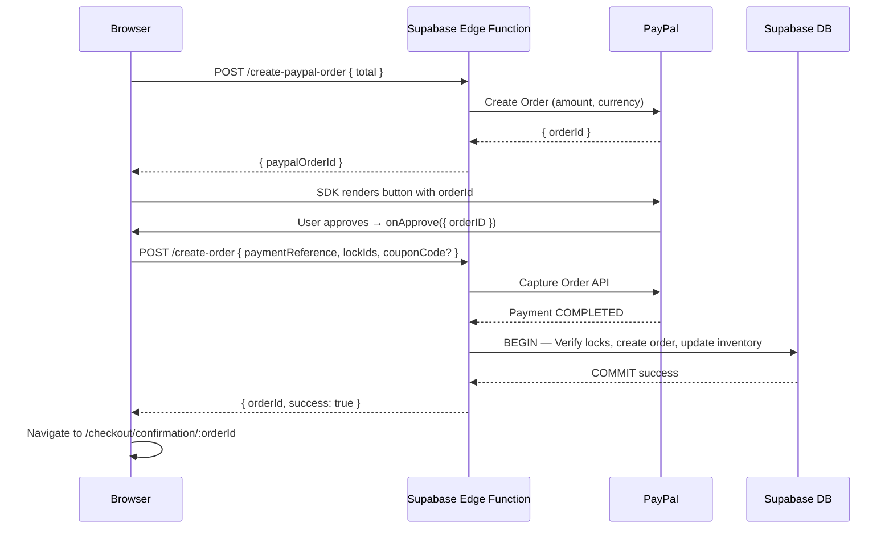

# Store App Blueprint

> Public-facing ticket store. Angular 18+ standalone components, TailwindCSS, Supabase.

---

## Design Palette

| Token | Hex | Usage in Store App |
|-------|-----|-------------------|
| `primary` | `#0bdef5` | Links, active states, navbar accents |
| `surface` | `#fff3f0` | Text/icons on dark backgrounds (hero) |
| `accent` | `#f7e733` | Prices, featured event badge, "Popular" label |
| `dark` | `#150811` | Hero background, body text |
| `contrast` | `#e11392` | Buy buttons, sold-out urgency, countdown timer |

---

## Architecture

**Vertical Slicing** — each feature is fully self-contained. No NgModules. All routes lazy-loaded.

---

## App File Structure

```
apps/store/src/
├── app/
│   ├── app.component.ts           # Root shell: navbar + router-outlet + footer
│   ├── app.config.ts              # provideRouter, provideHttpClient, provideSupabase
│   └── app.routes.ts              # Top-level lazy routes
├── features/
│   ├── auth/
│   │   ├── login/
│   │   │   └── login.component.ts
│   │   ├── register/
│   │   │   └── register.component.ts
│   │   └── auth.service.ts
│   ├── home/
│   │   ├── home.component.ts      # Hero + featured events + categories
│   │   └── home.service.ts
│   ├── search/
│   │   ├── search-results.component.ts   # Reads URL query params
│   │   ├── filter-panel.component.ts
│   │   ├── search.service.ts
│   │   └── search.routes.ts
│   ├── event-detail/
│   │   ├── event-detail.component.ts
│   │   ├── ticket-selector.component.ts   # Quantity steppers per ticket type
│   │   ├── venue-map.component.ts         # Google Maps embed
│   │   ├── event-detail.service.ts
│   │   └── event-detail.routes.ts
│   ├── checkout/
│   │   ├── cart-summary.component.ts      # Step 1: review + coupon
│   │   ├── coupon-input.component.ts
│   │   ├── payment.component.ts           # Step 2: PayPal
│   │   ├── order-confirmation.component.ts # Step 3: success
│   │   ├── checkout.service.ts
│   │   └── checkout.routes.ts
│   └── my-tickets/
│       ├── my-tickets.component.ts
│       ├── ticket-detail.component.ts
│       ├── my-tickets.service.ts
│       └── my-tickets.routes.ts
└── shared/
    ├── layout/
    │   ├── navbar.component.ts
    │   └── footer.component.ts
    ├── ui/
    │   ├── event-card.component.ts         # Used in home + search
    │   └── countdown-timer.component.ts    # Ticket lock countdown
    └── guards/
        └── auth.guard.ts                   # Redirect to /login if unauthenticated
```

---

## Route Structure

| Route | Component | Guard |
|-------|-----------|-------|
| `/` | `HomeComponent` | — |
| `/login` | `LoginComponent` | — |
| `/register` | `RegisterComponent` | — |
| `/search` | `SearchResultsComponent` | — |
| `/events/:id` | `EventDetailComponent` | — |
| `/checkout` | `CartSummaryComponent` | `authGuard` |
| `/checkout/payment` | `PaymentComponent` | `authGuard` |
| `/checkout/confirmation/:orderId` | `OrderConfirmationComponent` | `authGuard` |
| `/my-tickets` | `MyTicketsComponent` | `authGuard` |
| `/my-tickets/:orderId` | `TicketDetailComponent` | `authGuard` |

### Routing Tree



---

## Feature Descriptions

### Feature 1: Auth (Customer)

**Purpose:** Register and authenticate public customers.

```typescript
@Injectable({ providedIn: 'root' })
export class AuthService {
  private supabase = inject(SupabaseService).client;
  readonly currentUser = signal<User | null>(null);

  constructor() {
    this.supabase.auth.onAuthStateChange((_, session) => {
      this.currentUser.set(session?.user ?? null);
    });
  }

  async register(name: string, email: string, password: string): Promise<void>
  // 1. supabase.auth.signUp({ email, password, options: { data: { full_name: name } } })
  // 2. Trigger creates profile automatically
  // 3. INSERT user_roles { user_id, role: 'customer' }

  async login(email: string, password: string): Promise<void>
  // supabase.auth.signInWithPassword({ email, password })

  async socialLogin(provider: 'google'): Promise<void>
  // supabase.auth.signInWithOAuth({ provider, options: { redirectTo: window.location.origin } })

  async logout(): Promise<void>
  // supabase.auth.signOut()
}
```

**UI Notes:**
- After login → redirect to previous page (stored via `Router` extras state) or `/`
- After register → redirect to `/` (email confirmation notice shown)
- Error messages displayed in `contrast` (`#e11392`)

---

### Feature 2: Home

**Purpose:** Landing page. First impression, featured events, search entry point.

```typescript
export class HomeService {
  async getFeaturedEvents(): Promise<EventSummary[]>
  // SELECT events (with min ticket price) WHERE status = 'published'
  // AND event_date > now() ORDER BY event_date ASC LIMIT 12

  async getEventTypes(): Promise<EventType[]>
  // SELECT * FROM event_types ORDER BY name
}
```

**UI Layout:**
1. **Hero section** — full-width, dark (`#150811`) background
   - Headline in `surface` (`#fff3f0`)
   - Sub-headline or tagline in `accent` (`#f7e733`)
   - "Browse Events" button in `contrast` (`#e11392`)
   - Search bar centered (large, with placeholder "Search events, artists, venues…")
2. **Category chips row** — event types; active in `primary`, inactive as outlined pills
3. **Featured Events grid** — 3-column on desktop, 1-column mobile; `EventCardComponent`

---

### Feature 3: Search

**Purpose:** Full-text + filtered browsing of published events.

**URL State:** All filters live in URL query params → shareable, browser-back works.

```
/search?q=coldplay&type=<uuid>&dateFrom=2025-06-01&dateTo=2025-12-31&page=1
```

```typescript
export class SearchService {
  async searchEvents(params: SearchParams): Promise<{ events: EventSummary[]; total: number }> {
    let query = supabase
      .from('events')
      .select('*, artists(name), venues(name), ticket_types(price)', { count: 'exact' })
      .eq('status', 'published')
      .gt('event_date', new Date().toISOString());

    if (params.query) {
      query = query.or(`name.ilike.%${params.query}%,artists.name.ilike.%${params.query}%,venues.name.ilike.%${params.query}%`);
    }
    if (params.eventTypeId) query = query.eq('event_type_id', params.eventTypeId);
    if (params.dateFrom) query = query.gte('event_date', params.dateFrom);
    if (params.dateTo) query = query.lte('event_date', params.dateTo);

    const { data, count } = await query
      .range((page - 1) * pageSize, page * pageSize - 1)
      .order('event_date');
    
    return { events: data!, total: count! };
  }
}

interface SearchParams {
  query?: string;
  eventTypeId?: string;
  dateFrom?: string;
  dateTo?: string;
  page?: number;
  pageSize?: number;
}
```

**UI Notes:**
- `FilterPanelComponent` — collapsible on mobile
- Results shown as `EventCardComponent` grid
- Debounce text input 300ms before triggering search
- Empty state with illustration + "Try a different search" suggestion
- Loading: skeleton cards (3 rows of 3)

---

### Feature 4: Event Detail

**Purpose:** Full event info, venue location map, and ticket selection with lock.

```typescript
export class EventDetailService {
  async getEvent(id: string): Promise<EventDetail>
  // SELECT events WITH artist, venue, venue_configuration, ticket_types (active only)

  async lockTickets(selections: TicketSelection[]): Promise<LockResult> {
    const sessionId = this.getOrCreateSessionId();
    const results = [];
    for (const sel of selections) {
      const { data } = await supabase.rpc('reserve_tickets', {
        p_ticket_type_id: sel.ticketTypeId,
        p_quantity: sel.quantity,
        p_session_id: sessionId,
      });
      results.push(data);
    }
    return results.every(r => r.success)
      ? { success: true, locks: results }
      : { success: false, error: 'insufficient_stock' };
  }

  private getOrCreateSessionId(): string {
    let id = sessionStorage.getItem('tf_session_id');
    if (!id) {
      id = crypto.randomUUID();
      sessionStorage.setItem('tf_session_id', id);
    }
    return id;
  }
}

interface TicketSelection { ticketTypeId: string; quantity: number; }
interface LockResult {
  success: boolean;
  locks?: Array<{ lock_id: string; locked_until: string }>;
  error?: string;
}
```

**Components:**

| Component | Description |
|-----------|-------------|
| `EventDetailComponent` | Main container — flyer, description, artist bio |
| `TicketSelectorComponent` | Per ticket type: name, price badge, quantity stepper, availability |
| `VenueMapComponent` | Google Maps embed with marker at `venue.latitude/longitude` |

**TicketSelectorComponent:**
```typescript
@Component({ selector: 'store-ticket-selector', standalone: true })
export class TicketSelectorComponent {
  @Input() ticketTypes!: TicketType[];
  @Output() selectionChanged = new EventEmitter<TicketSelection[]>();

  quantities = signal<Record<string, number>>({});

  available(tt: TicketType): number {
    return tt.stock - tt.sold - tt.reserved;
  }
  // Stepper: min=0, max=available(tt), disabled if available=0
  // Price badge: accent #f7e733
  // "Sold Out" label: contrast #e11392
}
```

**UI Notes:**
- "Add to Cart" button: `contrast` (`#e11392`), disabled if no quantity selected
- On lock failure → inline toast "Not enough tickets available, please select fewer"
- On success → navigate to `/checkout`, store lock IDs in CheckoutService signal

---

### Feature 5: Checkout

**Purpose:** Multi-step purchase — cart review → PayPal payment → confirmation.

#### Checkout Service (shared state across checkout steps)

```typescript
@Injectable({ providedIn: 'root' })
export class CheckoutService {
  readonly locks = signal<TicketLock[]>([]);
  readonly coupon = signal<AppliedCoupon | null>(null);
  readonly commissionRate = signal<number>(0.20);

  readonly subtotal = computed(() =>
    this.locks().reduce((sum, l) => sum + l.quantity * l.unit_price, 0)
  );
  readonly discount = computed(() =>
    this.coupon() ? this.coupon()!.discountAmount : 0
  );
  readonly commission = computed(() =>
    (this.subtotal() - this.discount()) * this.commissionRate()
  );
  readonly total = computed(() =>
    this.subtotal() - this.discount() + this.commission()
  );

  async applyCoupon(code: string, eventId: string): Promise<CouponResult> {
    const res = await supabase.functions.invoke('apply-coupon', {
      body: { couponCode: code, eventId, subtotal: this.subtotal() },
    });
    if (res.data.valid) this.coupon.set(res.data);
    return res.data;
  }

  async initiatePayPalOrder(): Promise<string> {
    const res = await supabase.functions.invoke('create-paypal-order', {
      body: { total: this.total(), currency: 'USD' },
    });
    return res.data.paypalOrderId;
  }

  async finalizeOrder(paymentReference: string): Promise<Order> {
    const res = await supabase.functions.invoke('create-order', {
      body: {
        paymentReference,
        lockIds: this.locks().map(l => l.lockId),
        customerId: auth.currentUser()?.id,
        couponCode: this.coupon()?.code,
      },
    });
    return res.data;
  }

  async releaseAllLocks(): Promise<void> {
    for (const lock of this.locks()) {
      await supabase.rpc('release_ticket_lock', { p_lock_id: lock.lockId });
    }
    this.locks.set([]);
  }
}
```

#### Step 1: Cart Summary (`/checkout`)

**UI:**
- Line items table: Ticket name | Qty | Unit price | Line total
- Coupon input: text field + "Apply" button
  - On valid: show discount line in `accent` (`#f7e733`)
  - On invalid: show error in `contrast`
- Summary box:
  ```
  Subtotal:              $1,000.00
  Discount (PROMO10):     -$100.00
  Service fee (20%):      +$180.00
  ─────────────────────────────────
  Total:               $1,080.00
  ```
- "Proceed to Payment" → navigate to `/checkout/payment`
- `CountdownTimerComponent` showing lock expiry (becomes red when < 2 min)

#### Step 2: Payment (`/checkout/payment`)

```typescript
@Component({ selector: 'store-payment', standalone: true })
export class PaymentComponent implements AfterViewInit {
  private checkout = inject(CheckoutService);
  private router = inject(Router);

  async ngAfterViewInit() {
    const paypal = await loadScript({ clientId: environment.paypalClientId });
    await paypal!.Buttons!({
      createOrder: () => this.checkout.initiatePayPalOrder(),
      onApprove: async (data) => {
        const order = await this.checkout.finalizeOrder(data.orderID);
        this.router.navigate(['/checkout/confirmation', order.id]);
      },
      onCancel: async () => {
        await this.checkout.releaseAllLocks();
        this.router.navigate(['/events', this.eventId]);
      },
      onError: (err) => {
        this.errorMessage.set('Payment failed. Please try again.');
      },
    }).render('#paypal-container');
  }
}
```

**UI:**
- Order summary sidebar (read-only) + `CountdownTimerComponent`
- PayPal button in `#paypal-container` div
- Warning banner if lock expires during payment (offer to restart)

#### Step 3: Confirmation (`/checkout/confirmation/:orderId`)

**UI:**
- ✅ Large success icon in `primary` (`#0bdef5`)
- Order ID in `accent` badge
- Purchased tickets list: event, date, venue, ticket types, quantities
- "View My Tickets" button
- "Share this event" link (optional for MVP)

---

#### Ticket Lock Lifecycle



---

#### Full Checkout Flow



---

#### PayPal Sequence



---

### Feature 6: My Tickets

**Purpose:** Customer's confirmed order history.

```typescript
export class MyTicketsService {
  async getUserOrders(): Promise<OrderSummary[]> {
    const { data } = await supabase
      .from('orders')
      .select(`
        id, created_at, total, status,
        events (name, event_date, flyer_url, venues(name)),
        order_items (quantity, unit_price, ticket_types(name))
      `)
      .eq('customer_id', supabase.auth.getUser().then(r => r.data.user!.id))
      .eq('status', 'confirmed')
      .order('created_at', { ascending: false });
    return data!;
  }

  async getOrderDetail(orderId: string): Promise<OrderDetail>
}
```

**UI Notes:**
- List of order cards: event flyer thumbnail, event name, date, venue, ticket summary
- Each order card links to detail page
- Detail page: breakdown by ticket type, unique ticket ID per `order_item`
- Future: QR code per ticket (placeholder `<div id="qr-placeholder">` in MVP)

---

## Shared UI Components

### `EventCardComponent`

```typescript
@Component({ selector: 'store-event-card', standalone: true })
export class EventCardComponent {
  @Input({ required: true }) event!: EventSummary;
  // Shows: flyer image, event name, artist name, venue, formatted date
  // Minimum ticket price with accent (#f7e733) badge
  // Clicking navigates to /events/:id
  // "Sold Out" banner in contrast (#e11392) when no active tickets
}
```

### `CountdownTimerComponent`

```typescript
@Component({ selector: 'store-countdown-timer', standalone: true })
export class CountdownTimerComponent implements OnInit, OnDestroy {
  @Input({ required: true }) lockedUntil!: string;  // ISO string
  @Output() expired = new EventEmitter<void>();

  private readonly remaining = signal(0);
  readonly formattedTime = computed(() => {
    const s = this.remaining();
    const m = Math.floor(s / 60);
    const sec = s % 60;
    return `${m}:${sec.toString().padStart(2, '0')}`;
  });
  readonly isUrgent = computed(() => this.remaining() < 120);  // < 2 minutes

  // Updates every second via setInterval
  // Emits 'expired' when remaining reaches 0
  // Text turns contrast (#e11392) when isUrgent()
}
```

---

## Edge Functions Required

| Function | Trigger | Description |
|----------|---------|-------------|
| `create-order` | POST after PayPal | Atomic order creation, inventory update |
| `apply-coupon` | POST | Validate coupon + calculate discount |
| `create-paypal-order` | POST | Server-side PayPal order creation |

See `04-SUPABASE-SETUP.md` for full Edge Function implementations.

---

## Environment Variables

```env
# apps/store/.env
VITE_SUPABASE_URL=https://xxxx.supabase.co
VITE_SUPABASE_ANON_KEY=eyJ...
VITE_PAYPAL_CLIENT_ID=AX...
VITE_GOOGLE_MAPS_API_KEY=AIza...
```

---

## Design System Usage Summary

| Feature | `primary` `#0bdef5` | `accent` `#f7e733` | `contrast` `#e11392` | `dark` `#150811` |
|---------|---------------------|--------------------|-----------------------|------------------|
| Home | Navbar, links | Prices, featured | "Browse" CTA | Hero background |
| Search | Active filter | Price on cards | — | Page bg |
| Event Detail | Headings | Ticket prices | "Buy Now" | Text |
| Checkout | Success states | Totals, order ID | Timer urgency, errors | Summary panels |
| My Tickets | Confirmed badge | Order ID badge | — | Page bg |
