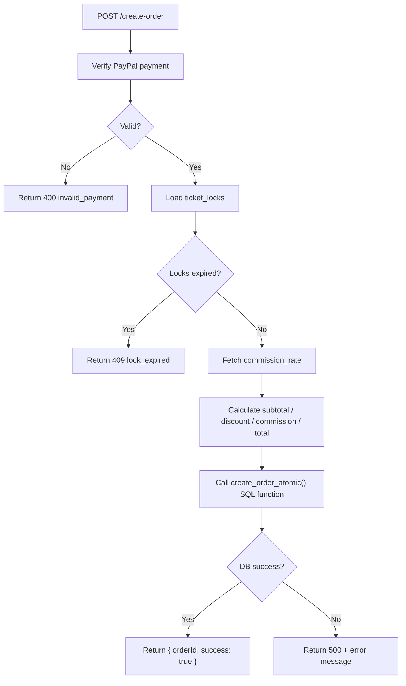

# Supabase Setup & Infrastructure

> Complete Supabase configuration for the TicketFlow platform — Auth, Storage, RLS, Edge Functions, pg_cron, and CLI.

---

## 1. Project Configuration

### Auth Settings (Dashboard → Authentication → Settings)
- **Email/Password**: Enabled
- **Email Confirmations**: Required for new signups
- **JWT Expiry**: 3600 seconds (1 hour)
- **RLS**: Enabled on all tables (enforced — no table is left unprotected)
- **Site URLs**: Add both app URLs to allowed redirect list
  - Admin App: `http://localhost:4200` (dev), `https://admin.ticketflow.app` (prod)
  - Store App: `http://localhost:4201` (dev), `https://ticketflow.app` (prod)

---

## 2. Storage Buckets

Create these buckets in **Storage → Buckets**:

| Bucket | Public | Max Size | Allowed MIME Types |
|--------|--------|----------|--------------------|
| `artist-photos` | ✅ | 5 MB | image/jpeg, image/png, image/webp |
| `event-flyers` | ✅ | 10 MB | image/jpeg, image/png, image/webp |
| `venue-maps` | ✅ | 20 MB | image/jpeg, image/png, application/pdf |

### Storage RLS Policies (SQL)

```sql
-- artist-photos: public read, owner upload/delete
CREATE POLICY "Public read artist-photos"
  ON storage.objects FOR SELECT
  USING (bucket_id = 'artist-photos');

CREATE POLICY "Auth upload to own artist-photos folder"
  ON storage.objects FOR INSERT
  WITH CHECK (
    bucket_id = 'artist-photos'
    AND auth.uid()::text = (storage.foldername(name))[1]
  );

CREATE POLICY "Owner delete artist-photos"
  ON storage.objects FOR DELETE
  USING (
    bucket_id = 'artist-photos'
    AND auth.uid()::text = (storage.foldername(name))[1]
  );

-- event-flyers: public read, auth upload/delete
CREATE POLICY "Public read event-flyers"
  ON storage.objects FOR SELECT
  USING (bucket_id = 'event-flyers');

CREATE POLICY "Auth upload event-flyers"
  ON storage.objects FOR INSERT
  WITH CHECK (bucket_id = 'event-flyers' AND auth.uid() IS NOT NULL);

CREATE POLICY "Owner delete event-flyers"
  ON storage.objects FOR DELETE
  USING (bucket_id = 'event-flyers' AND auth.uid() IS NOT NULL);

-- venue-maps: public read, auth upload/delete
CREATE POLICY "Public read venue-maps"
  ON storage.objects FOR SELECT
  USING (bucket_id = 'venue-maps');

CREATE POLICY "Auth upload venue-maps"
  ON storage.objects FOR INSERT
  WITH CHECK (bucket_id = 'venue-maps' AND auth.uid() IS NOT NULL);
```

---

## 3. Database Functions & Triggers

### 3.1 Auto-create Profile on User Signup

```sql
CREATE OR REPLACE FUNCTION public.handle_new_user()
RETURNS TRIGGER 
LANGUAGE plpgsql 
SECURITY DEFINER
SET search_path = public, auth, pg_temp
AS $$
DECLARE
  v_display_name TEXT;
  v_avatar_url   TEXT;
  v_role         public.role_type;
BEGIN
  v_display_name := COALESCE(
    NEW.raw_user_meta_data->>'full_name',
    NEW.raw_user_meta_data->>'name',
    NEW.raw_user_meta_data->>'display_name',
    split_part(COALESCE(NEW.email, ''), '@', 1),
    'Usuario'
  );

  v_avatar_url := COALESCE(
    NEW.raw_user_meta_data->>'avatar_url',
    NEW.raw_user_meta_data->>'picture'
  );

  BEGIN
    v_role := (NEW.raw_user_meta_data->>'role')::public.role_type;
  EXCEPTION WHEN OTHERS THEN
    v_role := 'customer'::public.role_type;
  END;

  IF v_role IS NULL THEN
    v_role := 'customer'::public.role_type;
  END IF;

  INSERT INTO public.profiles (id, display_name, avatar_url)
  VALUES (NEW.id, v_display_name, v_avatar_url)
  ON CONFLICT (id) DO UPDATE
  SET 
    display_name = COALESCE(public.profiles.display_name, EXCLUDED.display_name),
    avatar_url   = COALESCE(public.profiles.avatar_url, EXCLUDED.avatar_url),
    updated_at   = now();

  INSERT INTO public.user_roles (user_id, role)
  VALUES (NEW.id, v_role)
  ON CONFLICT (user_id, role) DO NOTHING;

  IF v_role = 'artist'::public.role_type THEN
    IF NOT EXISTS (SELECT 1 FROM public.artists WHERE user_id = NEW.id) THEN
      INSERT INTO public.artists (user_id, name, email, photo_url, created_by)
      VALUES (NEW.id, v_display_name, NEW.email, v_avatar_url, NEW.id);
    END IF;
  END IF;

  RETURN NEW;
EXCEPTION WHEN OTHERS THEN
  RAISE WARNING 'handle_new_user error: %', SQLERRM;
  RETURN NEW;
END;
$$;

GRANT EXECUTE ON FUNCTION public.handle_new_user() TO postgres, anon, authenticated, service_role, supabase_admin;

DROP TRIGGER IF EXISTS on_auth_user_created ON auth.users;
CREATE TRIGGER on_auth_user_created
  AFTER INSERT ON auth.users
  FOR EACH ROW EXECUTE FUNCTION public.handle_new_user();
```

> **Note:** The trigger auto-creates the profile, assigns the appropriate role (`customer` default or `artist` if specified in metadata), and provisions initial artist records if necessary.

### 3.2 Auto-update `updated_at`

```sql
CREATE OR REPLACE FUNCTION update_updated_at()
RETURNS TRIGGER AS $$
BEGIN
  NEW.updated_at = now();
  RETURN NEW;
END;
$$ LANGUAGE plpgsql;

-- Apply to every auditable table
DO $$ 
DECLARE
  tbl TEXT;
BEGIN
  FOR tbl IN SELECT unnest(ARRAY[
    'profiles', 'artists', 'venues', 'venue_configurations',
    'events', 'ticket_types', 'coupons', 'orders', 'platform_settings'
  ]) LOOP
    EXECUTE format(
      'CREATE TRIGGER trg_%s_updated_at BEFORE UPDATE ON %s FOR EACH ROW EXECUTE FUNCTION update_updated_at()',
      tbl, tbl
    );
  END LOOP;
END $$;
```

### 3.3 Atomic Ticket Reservation

```sql
CREATE OR REPLACE FUNCTION reserve_tickets(
  p_ticket_type_id UUID,
  p_quantity INT,
  p_session_id TEXT
) RETURNS JSONB AS $$
DECLARE
  v_available INT;
  v_lock_id UUID;
  v_locked_until TIMESTAMPTZ;
BEGIN
  SELECT (stock - sold - reserved) INTO v_available
  FROM ticket_types
  WHERE id = p_ticket_type_id
  FOR UPDATE;

  IF v_available < p_quantity THEN
    RETURN jsonb_build_object(
      'success', false,
      'error', 'insufficient_stock',
      'available', v_available
    );
  END IF;

  v_locked_until := now() + INTERVAL '15 minutes';
  
  INSERT INTO ticket_locks (ticket_type_id, session_id, quantity, locked_until)
  VALUES (p_ticket_type_id, p_session_id, p_quantity, v_locked_until)
  RETURNING id INTO v_lock_id;

  UPDATE ticket_types
  SET reserved = reserved + p_quantity
  WHERE id = p_ticket_type_id;

  RETURN jsonb_build_object(
    'success', true,
    'lock_id', v_lock_id,
    'locked_until', v_locked_until
  );
END;
$$ LANGUAGE plpgsql;
```

### 3.4 Release Single Lock

```sql
CREATE OR REPLACE FUNCTION release_ticket_lock(p_lock_id UUID)
RETURNS void AS $$
DECLARE
  v_ticket_type_id UUID;
  v_quantity INT;
BEGIN
  SELECT ticket_type_id, quantity
  INTO v_ticket_type_id, v_quantity
  FROM ticket_locks WHERE id = p_lock_id;

  IF FOUND THEN
    DELETE FROM ticket_locks WHERE id = p_lock_id;
    UPDATE ticket_types
    SET reserved = GREATEST(0, reserved - v_quantity)
    WHERE id = v_ticket_type_id;
  END IF;
END;
$$ LANGUAGE plpgsql;
```

### 3.5 Release Expired Locks (pg_cron target)

```sql
CREATE OR REPLACE FUNCTION release_expired_locks()
RETURNS INT AS $$
DECLARE v_count INT;
BEGIN
  WITH expired AS (
    DELETE FROM ticket_locks
    WHERE locked_until < now()
    RETURNING ticket_type_id, quantity
  )
  UPDATE ticket_types tt
  SET reserved = GREATEST(0, tt.reserved - e.total_qty)
  FROM (
    SELECT ticket_type_id, SUM(quantity) AS total_qty
    FROM expired
    GROUP BY ticket_type_id
  ) e
  WHERE tt.id = e.ticket_type_id;

  GET DIAGNOSTICS v_count = ROW_COUNT;
  RETURN v_count;
END;
$$ LANGUAGE plpgsql;
```

---

## 4. pg_cron Setup

Enable the `pg_cron` extension and schedule the expired lock cleanup:

```sql
-- Enable extension (Supabase Dashboard → Database → Extensions → pg_cron)
CREATE EXTENSION IF NOT EXISTS pg_cron;

-- Schedule: every minute
SELECT cron.schedule(
  'release-expired-locks',           -- job name
  '* * * * *',                       -- every minute
  'SELECT release_expired_locks()'
);
```

To verify the schedule is running:
```sql
SELECT * FROM cron.job;
SELECT * FROM cron.job_run_details ORDER BY start_time DESC LIMIT 10;
```

---

## 5. Edge Functions

### Overview

| Function | Trigger | Purpose |
|----------|---------|---------|
| `create-order` | POST (after PayPal success) | Atomic order creation |
| `apply-coupon` | POST | Coupon validation & discount calc |
| `release-expired-locks` | Optional HTTP (or use pg_cron SQL directly) | Cleanup expired locks |

### 5.1 `create-order` (Deno / TypeScript)

```typescript
// supabase/functions/create-order/index.ts
import { serve } from 'https://deno.land/std@0.168.0/http/server.ts'
import { createClient } from 'https://esm.sh/@supabase/supabase-js@2'

interface CreateOrderPayload {
  paymentReference: string;   // PayPal order ID
  lockIds: string[];          // ticket_lock IDs
  customerId: string;
  couponCode?: string;
}

serve(async (req) => {
  const { paymentReference, lockIds, customerId, couponCode }: CreateOrderPayload = await req.json();
  
  const supabase = createClient(
    Deno.env.get('SUPABASE_URL')!,
    Deno.env.get('SUPABASE_SERVICE_ROLE_KEY')!  // Service role to bypass RLS
  );

  // 1. Verify PayPal payment
  const paypalValid = await verifyPayPalPayment(paymentReference);
  if (!paypalValid) {
    return new Response(JSON.stringify({ error: 'invalid_payment' }), { status: 400 });
  }

  // 2. Load & verify locks
  const { data: locks } = await supabase
    .from('ticket_locks')
    .select('*, ticket_types(event_id, price)')
    .in('id', lockIds);

  const expired = locks?.filter(l => new Date(l.locked_until) < new Date());
  if (expired?.length > 0) {
    return new Response(JSON.stringify({ error: 'lock_expired' }), { status: 409 });
  }

  // 3. Get commission rate
  const { data: setting } = await supabase
    .from('platform_settings')
    .select('value')
    .eq('key', 'commission_rate')
    .single();
  const commissionRate = parseFloat(setting?.value ?? '0.20');

  // 4. Calculate totals
  let subtotal = 0;
  for (const lock of locks!) {
    subtotal += lock.quantity * lock.ticket_types.price;
  }

  let discountAmount = 0;
  let couponId: string | null = null;
  if (couponCode) {
    const couponResult = await applyCouponLogic(supabase, couponCode, locks![0].ticket_types.event_id, subtotal);
    discountAmount = couponResult.discountAmount;
    couponId = couponResult.couponId;
  }

  const commissionAmount = (subtotal - discountAmount) * commissionRate;
  const total = subtotal - discountAmount + commissionAmount;

  // 5. Atomic DB operations (using Postgres function for true atomicity)
  const { data: order, error } = await supabase.rpc('create_order_atomic', {
    p_customer_id: customerId,
    p_event_id: locks![0].ticket_types.event_id,
    p_coupon_id: couponId,
    p_subtotal: subtotal,
    p_discount_amount: discountAmount,
    p_commission_amount: commissionAmount,
    p_total: total,
    p_payment_reference: paymentReference,
    p_commission_rate: commissionRate,
    p_lock_ids: lockIds,
  });

  if (error) {
    return new Response(JSON.stringify({ error: error.message }), { status: 500 });
  }

  return new Response(JSON.stringify({ orderId: order.id, success: true }), {
    headers: { 'Content-Type': 'application/json' },
  });
});

async function verifyPayPalPayment(orderId: string): Promise<boolean> {
  const clientId = Deno.env.get('PAYPAL_CLIENT_ID')!;
  const secret = Deno.env.get('PAYPAL_CLIENT_SECRET')!;
  const base64 = btoa(`${clientId}:${secret}`);

  // Get PayPal access token
  const tokenRes = await fetch('https://api-m.paypal.com/v1/oauth2/token', {
    method: 'POST',
    headers: { Authorization: `Basic ${base64}`, 'Content-Type': 'application/x-www-form-urlencoded' },
    body: 'grant_type=client_credentials',
  });
  const { access_token } = await tokenRes.json();

  // Capture the order
  const captureRes = await fetch(`https://api-m.paypal.com/v2/checkout/orders/${orderId}/capture`, {
    method: 'POST',
    headers: { Authorization: `Bearer ${access_token}`, 'Content-Type': 'application/json' },
  });
  const capture = await captureRes.json();
  return capture.status === 'COMPLETED';
}
```

**Edge Function Flow:**



### 5.2 `apply-coupon` (Deno)

```typescript
// supabase/functions/apply-coupon/index.ts
serve(async (req) => {
  const { couponCode, eventId, subtotal } = await req.json();
  const supabase = createClient(
    Deno.env.get('SUPABASE_URL')!,
    Deno.env.get('SUPABASE_SERVICE_ROLE_KEY')!
  );

  const { data: coupon } = await supabase
    .from('coupons')
    .select('*')
    .eq('code', couponCode.toUpperCase())
    .eq('is_active', true)
    .single();

  if (!coupon) {
    return json({ valid: false, message: 'Coupon not found' });
  }

  // Validate event scope
  if (coupon.event_id && coupon.event_id !== eventId) {
    return json({ valid: false, message: 'Coupon not valid for this event' });
  }

  // Validate date
  const now = new Date();
  if (coupon.valid_from && new Date(coupon.valid_from) > now) {
    return json({ valid: false, message: 'Coupon not yet active' });
  }
  if (coupon.valid_until && new Date(coupon.valid_until) < now) {
    return json({ valid: false, message: 'Coupon has expired' });
  }

  // Validate usage
  if (coupon.max_uses !== null && coupon.uses_count >= coupon.max_uses) {
    return json({ valid: false, message: 'Coupon has reached maximum uses' });
  }

  // Calculate discount
  let discountAmount = 0;
  if (coupon.type === 'courtesy') discountAmount = subtotal;
  else if (coupon.type === 'percentage') discountAmount = subtotal * (coupon.value / 100);
  else if (coupon.type === 'fixed') discountAmount = Math.min(coupon.value, subtotal);

  return json({
    valid: true,
    couponId: coupon.id,
    discountAmount,
    couponType: coupon.type,
    message: 'Coupon applied successfully',
  });
});
```

---

## 6. Supabase CLI Setup

### Installation & Initialization

```bash
# Install Supabase CLI
npm install -g supabase

# Initialize in your project root
supabase init

# Link to your remote Supabase project
supabase link --project-ref <your-project-ref>

# (Optional) Start local dev stack
supabase start
```

### Database Migrations

```bash
# Create a new migration file
supabase migration new create_initial_schema

# Edit the migration file in supabase/migrations/
# Then apply to local:
supabase db reset

# Push migrations to remote
supabase db push
```

### TypeScript Type Generation

```bash
# Generate types from your remote DB
supabase gen types typescript --project-id <your-project-ref> \
  > libs/shared/models/src/database.types.ts
```

Integrate in Angular services:

```typescript
import type { Database } from '@ticketflow/models';

type EventRow = Database['public']['Tables']['events']['Row'];
type EventInsert = Database['public']['Tables']['events']['Insert'];
```

### Deploying Edge Functions

```bash
# Deploy a single function
supabase functions deploy create-order

# Deploy all functions
supabase functions deploy

# Set secrets for Edge Functions
supabase secrets set PAYPAL_CLIENT_ID=AX...
supabase secrets set PAYPAL_CLIENT_SECRET=EL...
supabase secrets set GOOGLE_MAPS_API_KEY=AIza...
```

---

## 7. Environment Variables Reference

### Angular Apps (`.env` files)

```env
# apps/admin/.env
VITE_SUPABASE_URL=https://xxxx.supabase.co
VITE_SUPABASE_ANON_KEY=eyJhbGciOiJIUzI1NiIsInR5cCI6IkpXVCJ9...
VITE_GOOGLE_MAPS_API_KEY=AIzaSy...

# apps/store/.env
VITE_SUPABASE_URL=https://xxxx.supabase.co
VITE_SUPABASE_ANON_KEY=eyJhbGciOiJIUzI1NiIsInR5cCI6IkpXVCJ9...
VITE_PAYPAL_CLIENT_ID=AX...
VITE_GOOGLE_MAPS_API_KEY=AIzaSy...
```

### Edge Functions (Supabase Secrets)

| Variable | Used In | Description |
|----------|---------|-------------|
| `SUPABASE_URL` | All functions | Auto-injected by Supabase |
| `SUPABASE_SERVICE_ROLE_KEY` | All functions | Auto-injected by Supabase |
| `PAYPAL_CLIENT_ID` | `create-order` | PayPal API client ID |
| `PAYPAL_CLIENT_SECRET` | `create-order` | PayPal API secret |

---

## 8. Shared SupabaseService (Angular)

```typescript
// libs/shared/data-access/src/supabase.service.ts
import { Injectable } from '@angular/core';
import { createClient, SupabaseClient } from '@supabase/supabase-js';
import { environment } from '../environments/environment';
import type { Database } from '@ticketflow/models';

@Injectable({ providedIn: 'root' })
export class SupabaseService {
  readonly client: SupabaseClient<Database>;

  constructor() {
    this.client = createClient<Database>(
      environment.supabaseUrl,
      environment.supabaseAnonKey
    );
  }
}
```

---

## 9. Monitoring

- **Supabase Dashboard**: Monitor DB queries, slow queries, auth events, storage usage
- **pg_cron logs**: `SELECT * FROM cron.job_run_details ORDER BY start_time DESC LIMIT 50`
- **Edge Function logs**: Available in Supabase Dashboard → Edge Functions → Logs
- **Alert on**: auth errors, high DB CPU, failed Edge Function invocations

---

## 10. Local Development Checklist

```bash
# 1. Start Supabase local stack
supabase start

# 2. Apply all migrations
supabase db reset

# 3. Seed catalog data
supabase db seed

# 4. Generate TypeScript types
supabase gen types typescript --local > libs/shared/models/src/database.types.ts

# 5. Serve edge functions locally
supabase functions serve

# 6. Start Angular apps
nx serve admin   # http://localhost:4200
nx serve store   # http://localhost:4201
```
