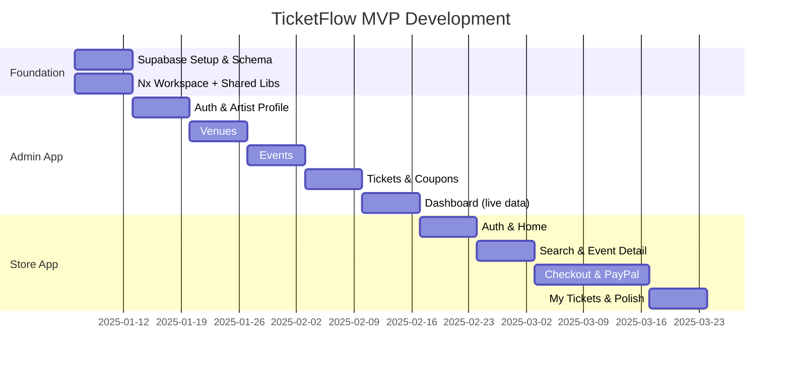

# Development Plan & MVP Roadmap

> Step-by-step implementation guide for TicketFlow — from workspace setup to shipping MVP.

---

## Tech Stack Reference

| Layer | Tech | Version |
|-------|------|---------|
| Angular | Standalone components + Signals | 18+ |
| Monorepo | Nx Workspace | 19+ |
| Styling | TailwindCSS | 3.x |
| Backend | Supabase (PostgreSQL + Auth + Storage + Edge Functions) | Latest |
| Maps | Google Maps API | — |
| Payments | PayPal JS SDK | v2 |
| Language | TypeScript | 5+ strict mode |

---

## Phase 0: Monorepo & Workspace Setup

### Step 1: Prerequisites

```bash
node -v           # >= 20.x
npm -v            # >= 10.x
npx nx --version  # will install if missing
```

### Step 2: Create Nx Workspace with Angular

```bash
npx create-nx-workspace@latest ticketflow --preset=angular-monorepo --appName=admin --style=css --routing=true --ssr=false
cd ticketflow
```

### Step 3: Generate the Store App

```bash
nx g @nx/angular:app store --routing=true --style=css --standalone=true
```

### Step 4: Create Shared Libraries

```bash
# Shared UI components (Button, Card, Badge, etc.)
nx g @nx/angular:lib shared-ui --buildable --standalone

# Shared data access (SupabaseService, AuthService)
nx g @nx/angular:lib data-access --buildable --standalone

# Shared TypeScript models and interfaces
nx g @nx/angular:lib models --buildable
```

### Step 5: Install Dependencies

```bash
# Supabase client
npm install @supabase/supabase-js

# PayPal SDK
npm install @paypal/paypal-js

# Google Maps (Angular wrapper)
npm install @angular/google-maps

# TailwindCSS
npm install -D tailwindcss postcss autoprefixer
npx tailwindcss init
```

### Step 6: Configure TailwindCSS

Create `tailwind.config.js` in root:

```js
/** @type {import('tailwindcss').Config} */
module.exports = {
  content: [
    './apps/**/*.{html,ts}',
    './libs/**/*.{html,ts}',
  ],
  theme: {
    extend: {
      colors: {
        primary:  '#0bdef5',   // Main cyan
        surface:  '#fff3f0',   // Text on dark
        accent:   '#f7e733',   // Yellow highlight
        dark:     '#150811',   // Text on light / dark BG
        contrast: '#e11392',   // Magenta CTA / danger
      },
      fontFamily: {
        sans: ['Inter', 'sans-serif'],
      },
    },
  },
  plugins: [],
};
```

Update each app's `styles.css`:
```css
@tailwind base;
@tailwind components;
@tailwind utilities;
```

### Step 7: TypeScript Path Aliases (`tsconfig.base.json`)

```json
{
  "compilerOptions": {
    "strict": true,
    "paths": {
      "@ticketflow/shared-ui": ["libs/shared-ui/src/index.ts"],
      "@ticketflow/data-access": ["libs/data-access/src/index.ts"],
      "@ticketflow/models": ["libs/models/src/index.ts"]
    }
  }
}
```

### Step 8: Supabase CLI Setup

```bash
npm install -g supabase
supabase init
supabase link --project-ref <your-project-ref>
```

---

## Development Phases

### Phase 1: Foundation (Week 1–2)

**Goal:** Database + shared services working end-to-end.

#### Tasks

- [ ] Create Supabase project in dashboard
- [ ] Write and apply all DB migrations (enums, tables, triggers, RLS)
- [ ] Seed catalog tables (artist_types, event_types, platform_settings)
- [ ] Configure storage buckets (artist-photos, event-flyers, venue-maps)
- [ ] Set up pg_cron for expired lock cleanup
- [ ] Generate TypeScript types: `supabase gen types typescript`
- [ ] Implement `SupabaseService` in `data-access` lib
- [ ] Implement `AuthService` with Angular Signal for current user
- [ ] Build shared UI components: Button, Card, Badge, Input, StatCard, FileUpload
- [ ] Configure TailwindCSS with custom design tokens in both apps

#### Deliverable
Working `SupabaseService` that connects to DB, Auth signal reactive to login/logout, shared UI components browsable in Storybook (optional) or a demo page.

---

### Phase 2: Admin — Auth & Artist Profile (Week 3)

**Goal:** Artists can register, log in, and manage their profile.

#### Tasks

- [ ] Admin app routing shell (`app.routes.ts` with lazy loading)
- [ ] `AdminShellComponent` with sidebar + topbar layout
- [ ] Auth feature: `LoginComponent`, `RegisterComponent`
- [ ] `AuthService.register()` → creates profile + assigns `artist` role
- [ ] `authGuard` and `noAuthGuard` route guards
- [ ] Artists feature: `ArtistDetailComponent`, `ArtistFormComponent`
- [ ] Photo upload to `artist-photos` bucket
- [ ] `artist_types` dropdown from catalog
- [ ] Dashboard shell (static layout, placeholder stats)

#### Deliverable
Artist can register → see empty dashboard → fill out profile → upload photo.

---

### Phase 3: Admin — Venues (Week 4)

**Goal:** Artists can create and browse venues, including configurations.

#### Tasks

- [ ] Venues feature: List, Form, Detail components
- [ ] Google Maps picker for latitude/longitude in venue form
- [ ] Map file upload to `venue-maps` bucket
- [ ] Venue Configurations: list + CRUD within venue detail
- [ ] `VenuePickerComponent` (searchable dropdown, reusable)
- [ ] Verified badge display (admin-only toggle hidden from artists)

#### Deliverable
Artist can create a venue with map coordinates + upload a map image. Configurations can be added/edited. Venue picker works standalone.

---

### Phase 4: Admin — Events (Week 5)

**Goal:** Artists can create, edit, and publish events.

#### Tasks

- [ ] Events feature: List, Form, Detail components
- [ ] Flyer upload to `event-flyers` bucket
- [ ] Event type catalog dropdown
- [ ] Venue picker integrated in event form
- [ ] Venue configuration picker (filtered by selected venue)
- [ ] Date/time pickers for `event_date` and `doors_open`
- [ ] Status workflow: Draft → Published (with confirmation prompt)
- [ ] Status badges with design palette colors
- [ ] Event list with filtering by status

#### Deliverable
Artist can create a full event → select venue → publish it. Published event visible in event list with yellow badge.

---

### Phase 5: Admin — Tickets & Coupons (Week 6)

**Goal:** Artists can define ticket types and promotional codes per event.

#### Tasks

- [ ] Ticket Types feature: list + form per event
- [ ] SKU validation (unique per event, async validator)
- [ ] Commission display component (base price → 20% fee → net to artist)
- [ ] Stock / reserved / sold counters display
- [ ] Coupons feature: list + form per event
- [ ] Coupon type selector (courtesy / percentage / fixed)
- [ ] Random code generator utility
- [ ] Usage stats display (uses_count / max_uses)

#### Deliverable
Artist can define multiple ticket types for an event with pricing, and create coupons with different discount types.

---

### Phase 6: Admin — Dashboard (Week 7)

**Goal:** Real data flows into the artist dashboard.

#### Tasks

- [ ] `DashboardService` with aggregate Supabase queries
- [ ] Stat cards: Events count (by status), Tickets sold, Available, Net Revenue
- [ ] Upcoming events list (next 5)
- [ ] Connect dashboard data to real artist's events/orders
- [ ] Loading skeletons for async data

#### Deliverable
Dashboard shows live stats for the artist — numbers from real DB data.

---

### Phase 7: Store — Auth & Home (Week 8)

**Goal:** Customers can register/login and see the store home page.

#### Tasks

- [ ] Store app routing shell
- [ ] `NavbarComponent` + `FooterComponent`
- [ ] Auth feature (customer): `LoginComponent`, `RegisterComponent`
- [ ] `AuthService.register()` assigns `customer` role
- [ ] `HomeComponent` with hero section + featured events grid
- [ ] `EventCardComponent` (shared store UI)
- [ ] Category filter row (event_types)

#### Deliverable
Customer can register → land on home page with real published events shown.

---

### Phase 8: Store — Search & Event Detail (Week 9)

**Goal:** Customers can find events and view full details.

#### Tasks

- [ ] `SearchResultsComponent` with URL-based query params
- [ ] `FilterPanelComponent` (type, date range)
- [ ] Supabase full-text / ilike search implementation
- [ ] `EventDetailComponent` (flyer, description, artist info)
- [ ] `TicketSelectorComponent` (quantity steppers, stock awareness)
- [ ] `VenueMapComponent` (Google Maps embed)
- [ ] "Add to Cart" button calling `reserve_tickets()` DB function

#### Deliverable
Customer can search → find an event → select tickets → trigger reservation lock.

---

### Phase 9: Store — Checkout (Week 10–11)

**Goal:** End-to-end purchase flow works.

#### Tasks

- [ ] `CartSummaryComponent` showing locked tickets + totals
- [ ] `CouponInputComponent` calling `apply-coupon` Edge Function
- [ ] `CountdownTimerComponent` showing remaining lock time
- [ ] PayPal JS SDK integration in `PaymentComponent`
- [ ] `create-order` Edge Function (Deno) — full implementation
- [ ] `apply-coupon` Edge Function (Deno)
- [ ] PayPal sandbox testing
- [ ] `OrderConfirmationComponent`
- [ ] CanDeactivate guard: release locks on navigation away from checkout

#### Deliverable
Full purchase flow: select tickets → lock → coupon → PayPal → confirmation. Verified with PayPal sandbox.

---

### Phase 10: My Tickets & Polish (Week 12)

**Goal:** Customer can view purchases. Both apps are production-ready MVP.

#### Tasks

- [ ] `MyTicketsComponent` listing confirmed orders
- [ ] `TicketDetailComponent` with order details
- [ ] Unique ticket ID displayed (future QR code placeholder)
- [ ] Mobile responsiveness audit for both apps
- [ ] Error states and empty states for all lists
- [ ] Loading skeleton components throughout
- [ ] 404 page
- [ ] End-to-end test of full purchase flow
- [ ] Performance audit (lazy loading, image sizes)
- [ ] Production environment variables configured
- [ ] Supabase RLS final review

#### Deliverable
Both apps fully functional MVP, tested, mobile-friendly, ready for initial users.

---

## MVP Checklist

### Infrastructure
- [ ] Supabase project created
- [ ] All DB migrations applied
- [ ] Catalog data seeded
- [ ] Storage buckets configured
- [ ] pg_cron enabled and scheduled
- [ ] TypeScript types generated
- [ ] Edge Functions deployed
- [ ] Environment variables set in all environments

### Admin App
- [ ] Artist registration
- [ ] Artist login / logout
- [ ] Artist profile CRUD (with photo upload)
- [ ] Venue CRUD (with map picker + map upload)
- [ ] Venue configurations CRUD
- [ ] Event CRUD (with flyer upload, venue picker)
- [ ] Event publishing workflow
- [ ] Ticket type CRUD per event (with SKU validation)
- [ ] Commission display on ticket types
- [ ] Coupon CRUD per event
- [ ] Dashboard with live stats

### Store App
- [ ] Customer registration
- [ ] Customer login / logout
- [ ] Home page with featured events
- [ ] Search by name / type / date
- [ ] Event detail page
- [ ] Ticket selection with stock awareness
- [ ] Ticket lock (15 min reservation)
- [ ] Countdown timer during checkout
- [ ] Cart summary with coupon application
- [ ] PayPal payment integration
- [ ] Order confirmation page
- [ ] My Tickets page

---

## Technical Decisions Log

| Decision | Choice | Rationale |
|----------|--------|-----------|
| Monorepo tool | Nx | Shared libs, TypeScript paths, build caching across both apps |
| State management | Angular Signals | Sufficient for MVP; no NgRx boilerplate overhead |
| Backend | Supabase | Instant auth, RLS, storage, edge functions — no custom server needed for MVP |
| Payment | PayPal | Wide adoption in LATAM; straightforward JS SDK |
| Lock window | 15 minutes | Long enough for checkout; short enough to not block inventory |
| SKU scope | Per event | Prevents global SKU namespace pollution; simpler artist UX |
| Commission storage | `platform_settings` + snapshot on `order_items` | Rate can change without affecting historical data |
| Styling | TailwindCSS | Utility-first; design tokens map directly to the brand palette |

---

## Open Questions & Future Enhancements

### For Future Sprints (Post-MVP)
- [ ] QR code generation per ticket for venue scanning
- [ ] Multiple artists per event (co-headlining)
- [ ] Seat map with individual seat selection
- [ ] Progressive Web App (PWA) / Capacitor mobile app
- [ ] Email notifications via Supabase + Resend
- [ ] Artist revenue payouts via PayPal Payouts API
- [ ] Waitlist for sold-out events
- [ ] Refund management workflow
- [ ] Admin superuser panel (venue verification, user management)
- [ ] Multi-currency support
- [ ] Social login (Google OAuth via Supabase)
- [ ] Event series / recurring events
- [ ] Ticket transfer between customers

---

## Developer Onboarding Checklist

For a new developer joining the project:

```bash
# 1. Prerequisites
node --version      # Must be >= 20
npm --version       # Must be >= 10

# 2. Clone and install
git clone <repo-url>
cd ticketflow
npm install

# 3. Install Supabase CLI
npm install -g supabase

# 4. Configure environment files
cp apps/admin/.env.example apps/admin/.env
cp apps/store/.env.example apps/store/.env
# Fill in: VITE_SUPABASE_URL, VITE_SUPABASE_ANON_KEY, API keys

# 5. Link to Supabase project
supabase link --project-ref <project-ref>

# 6. Apply DB migrations
supabase db push

# 7. Generate TypeScript types
supabase gen types typescript --project-id <project-ref> > libs/models/src/database.types.ts

# 8. Serve apps
nx serve admin   # http://localhost:4200
nx serve store   # http://localhost:4201

# 9. Run tests
nx test admin
nx test store
nx affected --target=test   # Only test changed code
```

---

## Development Timeline (Gantt)


