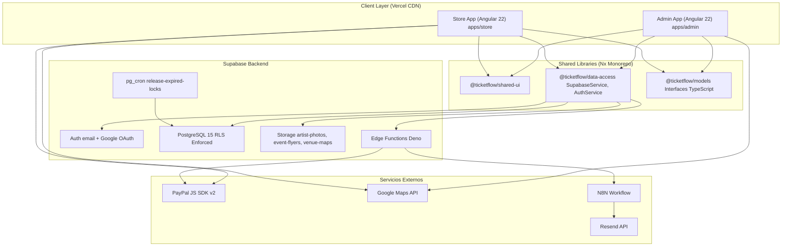
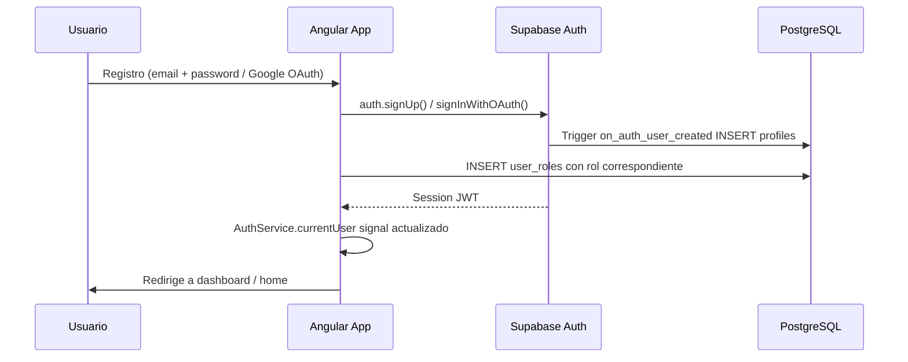
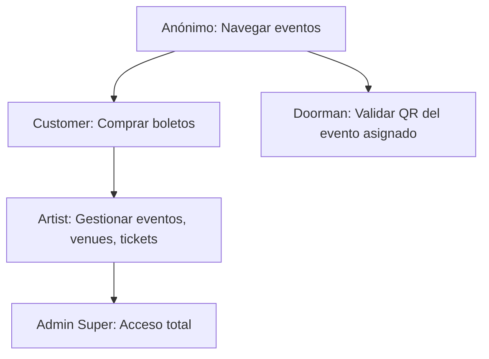
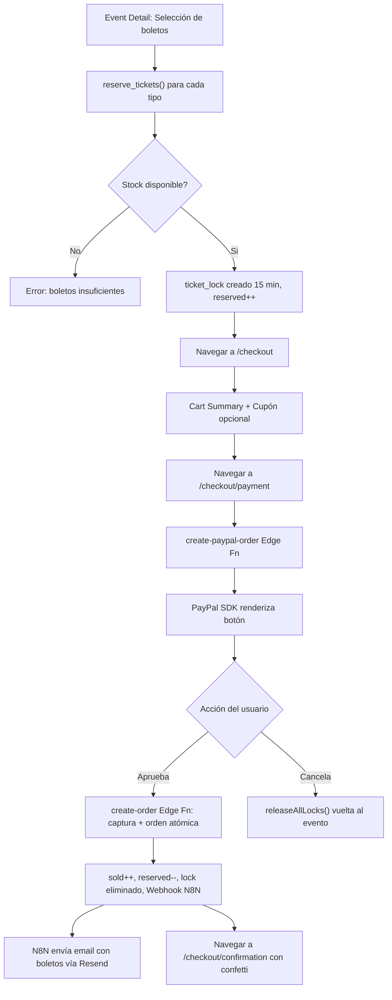

# Architecture — TicketFlow

> **Versión:** 1.0  
> **Fecha:** Septiembre 2026  
> **Stack:** Angular 22 · Nx 23 · Supabase · Deno Edge Functions · PayPal · N8N

---

## 1. Visión General

TicketFlow es un **monorepo Nx** con dos aplicaciones Angular que comparten un único proyecto Supabase como backend. No existe servidor propio — toda la lógica de servidor corre en Edge Functions (Deno) o directamente en PostgreSQL (RLS, funciones SQL, pg_cron).

---

## 2. Estructura del Monorepo

```
tickets/                          ← Raíz del repositorio
└── ticketflow/                   ← Nx Workspace
    ├── apps/
    │   ├── admin/                ← App Admin (portal de artista)
    │   │   └── src/app/
    │   │       ├── core/guards/  ← auth, no-auth, artist-role, doorman, super-admin
    │   │       └── features/     ← auth, dashboard, artists, events, venues, tickets
    │   └── store/                ← App Store (tienda pública)
    │       └── src/app/
    │           └── features/     ← home, search, event-detail, checkout, my-tickets
    ├── libs/
    │   ├── data-access/          ← SupabaseService, AuthService (@ticketflow/data-access)
    │   ├── models/               ← Interfaces TS + database.types.ts (@ticketflow/models)
    │   └── shared-ui/            ← Componentes reutilizables (@ticketflow/shared-ui)
    ├── supabase/
    │   ├── migrations/           ← Archivos SQL (001–021)
    │   ├── functions/            ← Edge Functions Deno
    │   └── seed.sql
    └── docs/
```

---

## 3. Arquitectura de las Aplicaciones Angular

### Principio: Vertical Slicing

Cada feature es un **slice vertical autocontenido** — no hay capas horizontales globales.

```
features/events/
├── event-list/event-list.component.ts
├── event-form/event-form.component.ts
├── event-detail/event-detail.component.ts
├── events.service.ts
├── event.model.ts
└── events.routes.ts
```

### Principios de Implementación

| Principio | Implementación |
|-----------|----------------|
| **No NgModules** | Todos los componentes usan `standalone: true` |
| **Lazy Loading** | Todas las rutas usan `loadComponent` / `loadChildren` |
| **Estado Reactivo** | Angular Signals (`signal`, `computed`, `effect`) — sin NgRx |
| **Tipado estricto** | `strict: true` en TypeScript; tipos generados por Supabase CLI |
| **Path aliases** | `@ticketflow/data-access`, `@ticketflow/models`, `@ticketflow/shared-ui` |

---

## 4. Diagrama de Sistemas Completo



---

## 5. Capa de Base de Datos

### Tablas Principales

| Tabla | Descripción |
|-------|-------------|
| `profiles` | Extensión de `auth.users` con display_name y avatar_url |
| `user_roles` | Roles por usuario: `admin`, `artist`, `customer`, `doorman` |
| `artists` | Perfil del artista (nombre, foto, bio, galería, Meta Pixel, datos fiscales) |
| `artist_types` | Catálogo: Música, Comedia, Teatro, etc. |
| `venues` | Recintos con coordenadas, mapa, estado de verificación |
| `venue_configurations` | Layouts de un recinto (General, VIP, Aforo Completo) |
| `events` | Eventos con flyer, fecha, estado (draft/published/cancelled/completed) |
| `event_types` | Catálogo: Concierto, Stand-up, Obra, etc. |
| `ticket_types` | Localidades con SKU, precio, stock, reservados, vendidos |
| `coupons` | Códigos de descuento (cortesía, porcentaje, fijo) por evento o SKU |
| `orders` | Órdenes de compra (autenticadas o de invitados con access_token) |
| `order_items` | Líneas de orden con snapshot de precio y comisión |
| `ticket_locks` | Reservas temporales de 15 minutos durante checkout |
| `ticket_validations` | Log de escaneos QR en control de acceso |
| `event_staff` | Asignaciones de doormen a eventos |
| `staff_invitations` | Invitaciones por email para doormen |
| `refund_requests` | Solicitudes de reembolso con estado y motivo |
| `waitlist` | Lista de espera FIFO para eventos agotados |
| `platform_settings` | Configuración global (tasa de comisión, etc.) |
| `payouts` | Dispersiones de fondos a artistas |

### Row Level Security (RLS)

Supabase aplica RLS en todas las tablas. La función helper `has_role(role_type)` verifica el rol del usuario actual.

| Entidad | Anónimo | Customer | Artist | Doorman | Admin |
|---------|---------|----------|--------|---------|-------|
| Eventos publicados | ✅ lectura | ✅ lectura | ✅ propios (todo) | ✅ lectura | ✅ todo |
| Mis órdenes | — | ✅ propias | ✅ sus eventos | — | ✅ todo |
| Artistas | ✅ lectura | ✅ lectura | ✅ propio | — | ✅ todo |
| Validación QR | — | — | ✅ sus eventos | ✅ evento asignado | ✅ todo |
| Super Admin RPCs | — | — | — | — | ✅ todo |

### Mecanismo de Reserva de Inventario

```
stock     = total boletos creados por artista
sold      = compras confirmadas
reserved  = bloqueados en checkouts activos
available = stock - sold - reserved
```

Flujo atómico:
1. `reserve_tickets()` → crea `ticket_lock` + incrementa `reserved`
2. Checkout exitoso → `create-order`: incrementa `sold`, decrementa `reserved`, elimina lock
3. Checkout abandonado → `release_ticket_lock()` o pg_cron cada minuto

---

## 6. Edge Functions (Supabase Deno)

| Función | Trigger | Descripción |
|---------|---------|-------------|
| `create-paypal-order` | POST desde Store | Crea orden PayPal en el servidor |
| `create-order` | POST tras aprobación PayPal | Captura pago, crea orden atómica en DB, dispara N8N |
| `apply-coupon` | POST desde checkout | Valida cupón y calcula descuento |
| `send-ticket-email` | Desde `create-order` | Envía email de confirmación vía Resend |
| `send-staff-invite` | POST desde Admin | Crea invitación y envía email a doorman |

### Variables de Entorno (Secrets)

```
SUPABASE_URL
SUPABASE_SERVICE_ROLE_KEY
PAYPAL_CLIENT_ID
PAYPAL_CLIENT_SECRET
PAYPAL_MODE             (sandbox | live)
RESEND_API_KEY
EMAIL_FROM
STORE_BASE_URL
N8N_WEBHOOK_URL
```

---

## 7. Flujo de Autenticación



### Jerarquía de Roles



### Guards de Navegación

| Guard | Aplica a |
|-------|----------|
| `authGuard` | Rutas protegidas (requiere sesión) |
| `noAuthGuard` | `/login`, `/register` |
| `artistRoleGuard` | Rutas de gestión de eventos/venues |
| `doormanGuard` | `/access-control` (artist, admin o doorman) |
| `superAdminGuard` | `/super-admin/*` |

---

## 8. Flujo de Compra (End-to-End)



---

## 9. Librerías Compartidas

### `@ticketflow/data-access`

```typescript
export class SupabaseService {
  readonly client: SupabaseClient; // instancia única
}

export class AuthService {
  readonly currentUser = signal<User | null>(null);
  readonly profile = signal<Profile | null>(null);
  readonly roles = signal<string[]>([]);
  readonly avatarUrl = computed<string | null>(...);
  readonly isAuthenticated = computed(() => !!this.currentUser());
  
  async register(name, email, password): Promise<void>
  async login(email, password): Promise<void>
  async socialLogin(provider: 'google'): Promise<void>
  async logout(): Promise<void>
  async waitForAuthReady(): Promise<void>
}
```

### `@ticketflow/shared-ui`

| Componente | Selector | Descripción |
|-----------|----------|-------------|
| `ButtonComponent` | `tf-button` | Botón con variantes (primary, contrast, outline, ghost) |
| `CardComponent` | `tf-card` | Contenedor con sombra y borde |
| `BadgeComponent` | `tf-badge` | Píldora de estado con colores semánticos |
| `StatCardComponent` | `tf-stat-card` | Tarjeta de métrica con número en accent |
| `FileUploadComponent` | `tf-file-upload` | Upload con preview y validación |
| `SkeletonComponent` | `tf-skeleton` | Placeholder animado para carga |
| `ToastComponent` | `tf-toast-container` | Sistema de notificaciones global |
| `EmptyStateComponent` | `tf-empty-state` | Estado vacío ilustrado con CTA |

---

## 10. Despliegue

| Aplicación | Plataforma | URL |
|-----------|-----------|-----|
| Admin App | Vercel | `ticketflow-admin.vercel.app` |
| Store App | Vercel | *(URL pendiente de dominio propio)* |
| Edge Functions | Supabase | `supabase functions deploy` |
| Base de datos | Supabase Managed PostgreSQL | — |

### Variables de Entorno

```env
VITE_SUPABASE_URL=https://<project-ref>.supabase.co
VITE_SUPABASE_ANON_KEY=eyJ...
VITE_PAYPAL_CLIENT_ID=AX...       # solo store
VITE_GOOGLE_MAPS_API_KEY=AIza...  # admin y store
```

### Comandos Clave

```bash
nx serve admin          # http://localhost:4200
nx serve store          # http://localhost:4201
nx run-many -t build    # build de todos los proyectos
supabase db push        # aplicar migraciones pendientes
supabase gen types typescript --project-id <ref> > libs/models/src/database.types.ts
```

---

## 11. Integraciones de Terceros

### PayPal
- SDK `@paypal/paypal-js` cargado dinámicamente
- Toda interacción API ocurre en Edge Functions (secretos seguros)
- `PAYPAL_MODE=sandbox` (dev) / `PAYPAL_MODE=live` (prod)

### Google Maps
- SDK `@angular/google-maps`
- Admin: selector de coordenadas para crear recintos
- Store: mapa embed en detalle de evento

### N8N + Resend
- N8N recibe webhook de `create-order` y orquesta envío de emails
- Resend maneja el transaccional (requiere dominio con SPF, DKIM, DMARC)
- Plantilla HTML: `docs/n8n/ticket-email-template.html`
- Workflow exportable: `docs/n8n/ticketflow-n8n-workflow.json`

### Meta Pixel (Facebook)
- `MetaPixelService` en Store App
- Pixel por artista (configurado en perfil del artista)
- Eventos trackeados: `ViewContent`, `InitiateCheckout`, `Purchase`

---

## 12. Decisiones de Arquitectura

| Decisión | Elección | Razón |
|----------|----------|-------|
| Monorepo | Nx | Libs compartidas, TypeScript paths, cache de build |
| Estado | Angular Signals | Sin overhead de NgRx para el scope del proyecto |
| Backend | Supabase | Auth + RLS + Storage + Edge Functions sin servidor propio |
| Pago | PayPal JS SDK v2 | Alta adopción en LATAM |
| Lock de inventario | 15 minutos | Balance entre UX de checkout y liberación de stock |
| SKU scope | Por evento | Evita colisiones globales; UX más simple |
| Comisión | `platform_settings` + snapshot en `order_items` | Historial inmutable aunque cambie la tasa |
| Styling | TailwindCSS | Utility-first; tokens de diseño mapeados a la paleta |
| Email | N8N + Resend | Mayor control sobre plantilla y flujo |
